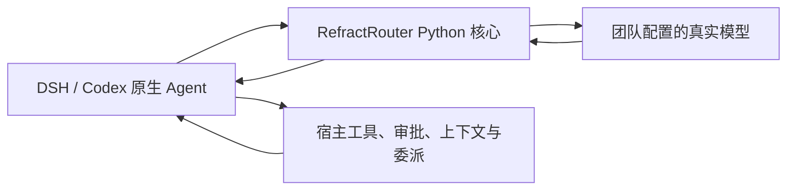

# RefractRouter（析衡）

面向小型开发团队的独立模型路由：**先满足可接受质量，再降低模型总成本，最后减少响应与等待时间。**

[在线文档](https://aealab.github.io/RefractRouter/) ·
[下载安装](https://aealab.github.io/RefractRouter/installation.html) ·
[首次任务](https://aealab.github.io/RefractRouter/quickstart.html) ·
[问题反馈](https://github.com/AEALab/RefractRouter/issues)

本次开发预览：核心 **0.16.33**、DSH 插件 **0.33.21**；已验证 DSH **0.1.5-rc.3**。
核对日期：2026-10-10。公开源码的版本以对应清单为准，预览下载包附匹配源码与 SHA-256。

## 两种路由

| 入口 | 工作方式 | 适用范围 |
| --- | --- | --- |
| **RefractAgent · 规划路由** | 保留 Agent 原生执行循环；选择模型、按需判别／审核／接管 | 文本与原生工具；六种策略及标准模型 Base URL |
| **RefractAgent · 自动路由** | 比较整任务 Direct 与任务 DAG；必要时规划、节点分配、并行调用及汇总 | 独立 DAG 研究入口；不通过标准模型 API 隐式启用 |

“规划”表示模型调用策略，不建立 DAG。“自动”不保证每次拆分，也不保证 DAG 更省钱或更快。
详情见[两种路由说明](https://aealab.github.io/RefractRouter/routing.html)。

## 规划路由的六种策略

| 策略 | 主要行为 | Judge 开销 |
| --- | --- | --- |
| Static | 固定高效角色，或两个执行角色加权随机一次；任务内保持 | 无 |
| Stage | 根据可信执行证据临时接管、保持并恢复 | 规则模式无；协作模式可选 Jev／Laya，标为实验 |
| Task | 任务开始从自选模型池选择主执行器，后续保持 | 多个合格候选一次，单候选跳过 |
| Composite | Task 初选常用模型，Stage 后续临时切换 | Task 一次；规则 Stage 无额外 Judge |
| Advisor Gate | 固定执行器，最多两次最终审核与一次返工；复审通过才交付 | 首审、必要复审 |
| Escalation | 检查起始候选，必要时一次接管并锁定 | 接管前候选 Judge；接管后停止 |

策略设置位于独立规划卡片，对话中从模型菜单的 **路由模式** 选择。
底层模型推理等级独立配置，不把 `rr:*` 策略值直接传给真实模型。
详见[日常指南](docs/planning-routing-daily-use.md)和[策略文档](https://aealab.github.io/RefractRouter/strategies/)。

## Router 与 Agent 的分工



Router 负责模型准入、选模、候选判别、回复来源和受管模型费用。
工具执行、权限、技能、系统提示组织、上下文压缩、子 Agent 与任务推进由接入方负责。
DSH 插件是宿主适配层，提供入口、设置、原生事件和图形；核心可以独立运行。

当前维护的客户端范围是 **DSH 与 Codex CLI**。历史 Hermes 等实验保留，
不将其解释为当前新增支持或所有 Agent 完整兼容。

## 下载、安装与开始使用

普通用户从[下载页](https://aealab.github.io/RefractRouter/installation.html)取得离线安装 zip，
解压并核对 SHA-256 后，在该目录执行：

```bash
uv tool install ./refractrouter-0.16.33-py3-none-any.whl
uv tool update-shell
dsh plugin --profile web add ./dsh-refractrouter-validation-0.33.21.tgz \
  --offline --ignore-scripts
```

先准备 Python ≥3.11、Node 22.x（≥22.19.0）、pnpm 10.15.0 与已验证的 DSH。
**沿用已有 `DSH_HOME`、profile、provider、凭证和会话**；不为了安装创建替代日常环境。
现有服务升级先备份，按原参数重启。首次安装的模型池初始化、路径、环境及回滚步骤见
[仓库内安装指南](docs/refractagent-local-quickstart.md)，在线安装页引用同一份说明。

在 DSH 模型设置中配置自己的 provider，再进入 RefractAgent 设置：

1. 从目录选择真实模型，核对推理等级、能力、价格与数据域。
2. 设置预算与任务限制，运行零调用诊断。
3. 先选择规划 Static 验证实际模型与原生工具。
4. 再逐策略配置 Judge，或显式启用自动路由真实执行。

默认模拟不调用模型；`[SIMULATED]` 或离线验收文字不是实际回答。
生产入口启用路由；`validation-tools` 是可选研究工具，默认关闭。
插件未发布为公开 npm 包，不按名称直接从 npm 安装。

## 独立 Base URL 接入

不使用 DSH 插件时，安装核心并配置独立模型服务：

```bash
refractrouter-gateway --config /绝对路径/gateway.json \
  --runs-dir /绝对路径/router-evidence --preflight
refractrouter-gateway --config /绝对路径/gateway.json \
  --runs-dir /绝对路径/router-evidence --host 127.0.0.1 --port 8088
```

Base URL：`http://127.0.0.1:8088/v1`。虚拟模型为 `refract/static`、`refract/stage`、
`refract/task`、`refract/composite`、`refract/advisor`、`refract/escalation`。
支持已验收的 Chat Completions／Responses 文本/function 子集；不执行宿主工具，不进入 DAG。

网关配置、认证、历史、推理协商和 Codex CLI 边界见[独立模型接口](docs/independent-model-router.md)。
`refractagent serve` 是另一套自定义任务 HTTP 协议，不是模型 Base URL；
DSH 网页地址也不是模型 API。

## Judge、费用与安全

- **Judge**：支持已接通的轻量 LLM、官方 Jev 和可选本地 Laya。新 Jev 配置默认通过
  OpenRouter；旧配置保留原渠道。不同用途使用不同合同，不把概率／分数当成功率。
- **金额**：新配置移除 AFP 计价，继续使用 Ark 订阅接口。CNY 参考估值与按量现金
  分别记录，不相加；USD 原价保留汇率与来源。旧 AFP 原始证据不追改。
- **外发**：每条路线绑定真实数据域；可信云须有相应信任策略，不继承其他 provider 授权。
- **调用**：原子保护预算，记录丢弃、判别、返工与失败尝试；零自动 HTTP 重试。
  用量未知停止，保留待核对预留，不自动重发。

详见[模型与费用](https://aealab.github.io/RefractRouter/configuration.html)、
[Jev 接入](docs/jev-planning-routing.md)、[金额迁移](docs/currency-only-migration.md)。

## 当前更新与验证边界

自动路由新增**自适应最终审核**：仅注册工具不强制审核；低风险 Direct 可跳过，
DAG、实际工具证据及候选风险仍需检查。材料完整去重，不截断；明确缺陷才允许已配置的
一次纠正与复审，证据不足和基础设施故障停止，不重跑工具。

功能更新已通过 2096 项无网络测试与 5 项子测试，原 DSH 简单任务完成一次真实模型调用
并跳过审核。两次 GLM 真实审核遇到提供方 429，没有有效判定，不能宣称真实审核质量已验收。
DAG 与路由轨迹均保留图形、记录收合、开始时间、耗时和动态事件展示。

本地 Laya 的多个用途质量仍为实验；完整图片／影片与审核、P6 子 Agent 共享预算未完成。
当前没有证据证明 DAG 或六策略在开放任务上普遍优于最合适的固定模型。
[验证范围](https://aealab.github.io/RefractRouter/status.html)区分功能接线、质量与收益。

## 开发与项目文档

```bash
uv sync --frozen --extra dev --extra deepagents
npm ci --prefix validation/dsh/plugin
npm run --prefix validation/dsh/plugin typecheck
npm run --prefix validation/dsh/plugin build
uv run pytest
```

| 目录 | 内容 |
| --- | --- |
| `src/refractrouter/` | 独立 Python 核心、策略、账本、DAG 研究运行时 |
| `validation/dsh/plugin/` | TypeScript 宿主集成、设置、进程与图形 |
| `validation/codex/` | Codex CLI 目录与工具证据适配 |
| `experiments/`、`data/`、`reports/` | 冻结实验、资料、原始证据及分析 |
| `website/` | 中文静态文档站源码与构建配置 |

- [架构与职责](docs/architecture.md)
- [DSH 插件说明](validation/dsh/plugin/README.md)
- [自动路由最新行为](docs/automatic-tool-evidence-and-next-steps.md)
- [规划路由支持矩阵](docs/planning-routing-support-matrix.md)
- [研究与历史证据索引](docs/research-index.md)
- [文档站构建与发布](website/README.md)

实验原始证据继续保留。功能完成、独立质量验收和成本／时延收益必须分别报告。
