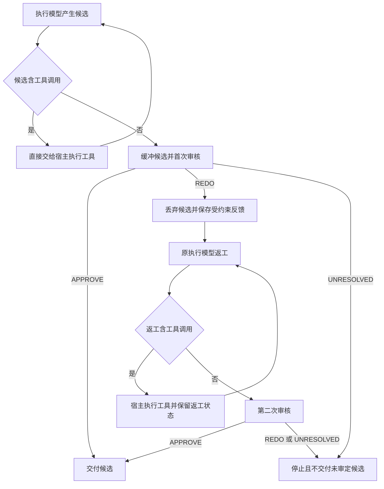

# Advisor Gate v2

## 目标

Advisor Gate 在准备交付最终回复时审核候选。Router 只负责调用执行模型、调用审核器、
决定候选是否交付并结算模型费用。工具执行、权限、提示组织、上下文压缩和任务推进仍由
DSH、Codex、Hermes 等接入方负责。

新版配置使用 `refractagent-planning-v6`，执行模型和审核器分别配置。标准模型接口公开
`refract/advisor`；DSH 插件继续提供相同策略的设置和轨迹视图。

## 状态机



每个任务固定最多两次审核和一次返工。工具续接、追加指导与宿主压缩不重置计数。
被丢弃候选只保存在审计记录中，不进入正常会话历史，也不会执行其中的工具调用。

## 审核合同

LLM 使用 `advisor-review-v2`，只接受以下严格 JSON 结果：

```json
{"verdict":"APPROVE|REDO|UNRESOLVED","feedback":"仅 REDO 需要"}
```

审核器逐项检查必需内容、禁止动作、输出格式与可信工具证据。候选声称执行了用户明确
禁止的动作时属于明确缺陷，即使没有工具事件佐证该动作。外部事实缺乏足够证据时返回
`UNRESOLVED`。非法结构、未知字段、缺少返工反馈、认证故障、传输故障或未知用量都会
停止，不会被当成批准。

本地 Laya 使用 `advisor-local-review-v2` 的 Choice 分类。低于门槛的结果映射为
`UNRESOLVED`。它不会生成自由文本理由；返工反馈由固定类别映射。当前真实题集未达到
质量门槛，因此界面保留实验标识，不能作为默认审核器。

## 预算与调用上限

第一次执行前检查以下完整路径：

1. 当前执行；
2. 首次审核；
3. 一次可能的返工执行；
4. 第二次审核。

这项保护只验证完整路径可承受，不把未派发调用记为已消费。真实派发后才产生账本预留。
返工包含工具续接时，每轮执行仍按实际输入重新检查，同时继续保护必要的第二次审核。
未知用量保留预留并停止；取消只释放未派发部分。

默认执行输出上限为 8192 tokens，LLM 审核输出上限为 1024 tokens，审核输入包络为
64 KiB，审核期限为 30 秒。请求还受模型容量、任务期限、预算和最大调用数约束。

## 兼容性

- v6 保存严格 Gate 行为；v5 及更早配置继续按旧合同读取，不自动改变历史行为。
- 设置页提供显式升级操作，用现有高效执行和审核角色预填 v6 字段。
- `refract/advisor` 使用标准 Chat Completions／Responses 文本和 function 工具合同。
- 客户端只接收已审核通过的最终文字，或需要客户端执行的正常工具调用。
- 路由轨迹记录审核次数、阶段、候选接受或丢弃、返工反馈、模型来源、费用和停止原因。

有限验收结果见
[Advisor Gate 验收报告](../reports/advisor-acceptance-20260928/README.md)。
