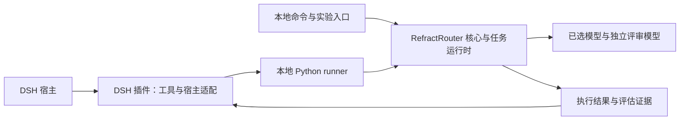

# 项目架构与职责边界

## 仓库与产品定位

本项目保留单仓库，通过目录区分 Router 核心、实验验证和 DSH 插件。
RefractRouter 的核心是任务分解感知的异构模型路由：根据质量、成本和时延要求，
为 DAG 节点联合选择模型与 reasoning effort，并通过组合执行与最终评估检验结果。

DSH 插件承担两项用途：验证核心功能在真实宿主中的可行性，以及探索未来的产品入口。
“DSH + 插件连接核心 Router”是产品化的实现形态之一；核心能力应可由其他入口复用。
插件安装、启动和模拟执行通过，只能证明对应集成路径可用；路由是否改善质量、成本或
时延，仍须依赖核心实验及独立评估证据。

当前保持同仓库便于核心、调用协议和插件在同一次变更中验证。目录边界如下：

| 层次 | 语言与目录 | 职责 |
|---|---|---|
| Router 核心与任务运行时 | Python：`src/refractrouter/` | DAG、节点模型分配、执行与上下文传递、策略、模型适配器、预算记账、成本与时延统计、评分与评估 |
| 实验与证据 | `experiments/`、`data/`、`reports/` | 组织对照实验、冻结任务与模型清单、保存可追溯证据 |
| DSH 插件 | TypeScript：`validation/dsh/plugin/src/` | 工具入口、配置与类型、宿主服务、进程与凭证边界、结果展示 |
| DSH 调用与验证入口 | Python：`validation/dsh/` 下的 runner | 连接插件与核心、组织验证、保存产物和证据 |
| DSH 契约测试 | TypeScript：`validation/dsh/plugin/tests/` | 宿主模拟、入口与包兼容性、零调用预检、预算与端点检查、进程控制 |

保留 `validation/dsh/` 路径以沿用现有安装、脚本与 CI 引用；该目录承载 DSH 验证和
产品入口探索，其名称不代表核心必须经由 DSH 才能使用。

## 调用与执行边界

下图表示当前本地调用关系；其他入口和独立部署仍可在此职责边界上演进。



冻结基准由应用提供固定 DAG，Python 通过 DeepAgents/LangGraph 执行。
文本任务运行时使用 `text-task-plan-v2` 请求模型生成最多 8 个节点的 DAG，
校验依赖字段、输出契约、能力容量与验收覆盖，并生成结构诊断。规划器必须说明拆分理由，
允许单节点及独立分支；详见 [拆分机制](dag-decomposition.md)。由 Python 校验后按依赖就绪顺序
执行文本节点，默认串行，可配置有界并发、provider 并发上限及启动间隔。
该路径使用独立的 Python 任务执行循环，调度预测与执行共享策略，预算预留原子化。两种路径的模型分配和评估均由
Python 负责。文本任务的质量 profile 是选模预测依据，实际质量由最终独立评估检验。

DSH 提供会话、工具调度、进程生命周期、沙箱和凭证服务。插件检查宿主输入及部署上限，
通过原生子进程服务启动固定 Python runner，并转换返回的证据。DSH 外层助手的模型配置
与 Router 对 DAG 节点的选模分别管理；采用 DSH LLM 桥时，桥按核心指定的模型执行请求。

核心业务接口不得绑定 DSH 类型或要求 DSH 会话。DSH 相关协议适配应留在集成边界，
插件不得重复实现路由、评分、预算记账或 Go/No-go 判定。TypeScript 部署预算上限用于
限制宿主可请求的范围，Python 负责逐次模型调用的预算账本。

历史实验的 AFP 清单保留 `ark-plan` 与精确的 `/api/plan/v3` 端点。插件仅在启用付费执行并提供
生产、评审两项显式预算后解析凭证。通用 DSH LLM 桥传递请求与遥测，不决定节点模型
或评估质量。

## 用户配置的 provider 与模型

应用的 `providerConfig` 由 Python 编译为模型清单与 `configured` 路由 profile，
支持一个或多个生产候选及一个评审模型。用户声明的质量和时延预测使用零观测样本，
不能替代经验数据；历史研究运行时仍要求实测 profile，不能直接借用应用配置绕过该条件。

Ark Agent Plan 是可选 provider 类型或显式预设。其他 provider 可由 Python 通过
Chat Completions / Responses 接口调用，或通过 DSH 原生模型服务适配。目标 provider 和模型均由
核心选定；插件只建立允许调用的宿主模型清单、传递请求并检查调用边界。
直接 HTTP 凭证通过专用子进程环境传递，宿主原生凭证保留在 DSH 中。
不同 provider 的同名模型由 provider 与模型 ID 共同标识，禁止回调 RefractAgent 自身。

价格必须使用用户声明的共同单位，Python 校验并记账，不自动换算货币或 AFP。
应用模型类型继承基础模型类型以增加 HTTP 认证和 token 参数选项，历史模型序列化保持原样。
Responses 的推理和正文共用输出包络，候选容量检查、预算预留与发送参数使用同一个上限；
历史协议仍保持 8192。解析器将正文、结束状态和用量转换为核心结果，不把推理条目当作答案。
应用候选以配置 ID 标识完整执行配置，同一 provider 的物理模型可以声明多个 reasoning effort。
Python 根据节点类型、难度、风险和输入包络匹配该候选的预测，再沿用现有 DAG 组合求解器。
不把 effort 变成跨模型通用质量分，也不要求规划器预先选择档位。默认预测与不重叠的分层
预测由用户提供；每次 profile 绑定有效请求设置与价格，不能跨档位直接复用。
预测成本可以使用包含推理 token 的 `outputTokens`，实际派发仍按完整输出上限预留；
预测可行不保证硬预留一定充足。执行与评审记录保留所发送的档位，DSH 只传配置和展示结果。
完整配置见 [provider 与模型说明](provider-configuration.md)。

## 当前交付边界

- RefractAgent 0.3.0 提供可安装的 Python 应用命令和随包资源。
  DSH 插件 0.11.0 的 `refractagent` provider 注册省成本、均衡、质量优先三个模型接口，
  通过原生子进程服务调用已安装核心，传入会话与部署上限；策略及记账仍完全由 Python 决定。
  该入口支持文本任务，不生成 DSH 工具调用，使用方式见
  [本机安装说明](refractagent-local-quickstart.md)。
- `refractrouter_validate` 调用基准验证入口；`refractrouter_task` 调用文本任务入口。
  这两个历史工具仍依赖匹配的 Python 源码环境和配置数据。
- RefractAgent 模型入口可脱离源码目录运行；当前仍是本机执行，没有独立 Router 服务。
  后续团队服务继续复用核心接口，DSH 保持为一种宿主接入方式。

## 实现语言与构建分发

显式启用的 v0.4 [证据状态实验](evidence-state-execution-modes.md) 将不可变来源归属、
整任务与 DAG 执行、对照分组和费用记账保留在 Python。DSH 仅传递配置并展示证据。

实现语言边界为 Python + TypeScript。Markdown、JSON 和 YAML 用于文档与数据；
TypeScript 编译生成的 JavaScript 是运行产物，不新增手写 JavaScript 实现。

插件 `src/index.ts` 编译到 `dist/index.js`，`main` 和 `exports` 指向生成入口，
`dist/*.d.ts` 提供类型声明。源码和测试编译配置均启用 `strict`，遇到错误时拒绝生成。
`contracts.ts` 的结构化宿主接口描述本包使用的 DSH `0.1.1-rc.2` 服务；通过类型模拟
和隔离 profile 启动验证兼容性。

`package-lock.json` 锁定 TypeScript 和 Node 类型开发依赖。构建命令为：

```bash
npm ci --prefix validation/dsh/plugin
npm run --prefix validation/dsh/plugin build
```

DSH 使用 pnpm `10.15.0` 安装 profile；npm 管理插件开发工具链。
私有插件包包含生成的 `dist/`、`package.json`、`cordis.patch.yml`、`README.md` 和
`CHANGELOG.md`。测试单独编译到忽略的 `.test-dist/` 并针对 `dist/` 执行，两个生成
目录都不提交。`npm pack` 通过 `prepack` 构建；安装源码目录前需要显式构建。
插件包没有运行时 npm 依赖，也不在安装时编译。RefractAgent 模型接口需要安装匹配的
Python 核心包；历史验证工具仍需要匹配的源码环境。

## 架构评审规则

新增实现语言或跨层复制业务决策前，应在架构 Issue 或 ADR 中记录提案，并在合并前取得
维护者批准。提案应说明职责归属、现有语言无法满足的需求、替代方案、依赖和分发成本、
数据契约、测试覆盖、迁移或回滚策略。如果提议重复实现，应明确权威实现及防止行为偏差
的方式。既有职责边界内的常规修改无需另行架构批准。

## 验证

CI 安装锁定的 Python 和 TypeScript 依赖，检查类型、构建插件并运行 `uv run pytest`，
其中包含编译后的 TypeScript 契约测试。兼容矩阵在 Node `22.19.0` 和最新 Node 22 上
启动 DSH `0.1.1-rc.2`，覆盖安装、配置覆盖、卸载、重装及源码和打包分发路径。
这些检查不调用模型。`reports/` 下已完成实验的原始证据继续保留。
