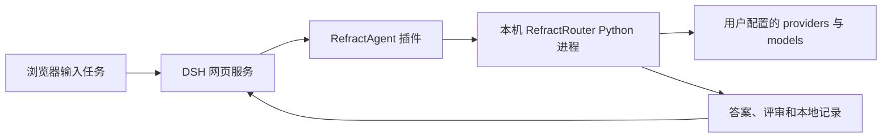

# RefractRouter 安装、启动与 DSH 使用指南

本指南帮助首次接触项目的用户安装 Python 核心、为 DSH 安装插件，并提交真实文本任务。
适用版本：RefractRouter `0.3.0`、DSH 插件 `0.11.0`；核对日期：2026-09-08。

项目名称为 **RefractRouter**；用户命令和 DSH 模型入口名称为 **RefractAgent（析衡）**。

## 1. 需要启动什么

当前版本的运行方式是：**启动 DSH 网页服务，插件在收到任务时自动启动本机 Python 核心**。
Python 子进程负责选模、执行、独立评审和保存结果，结束后退出。
安装核心后无需另开一个终端启动 Router 常驻服务。



| 组件 | 如何运行 | 地址或入口 |
| --- | --- | --- |
| RefractRouter 核心 | 插件自动调用；也可独立运行 CLI | `refractagent`，没有 HTTP 监听端口 |
| DSH 网页服务 | 在终端运行本指南的启动命令 | 本指南指定 `http://127.0.0.1:53611/` |
| 模型服务 | 核心直连用户配置的 HTTP provider，或经 DSH 调用已配置模型 | 用户的模型 API；Ark Agent Plan 可选 |

当前没有 `refractrouter serve`、独立 REST API 或已交付的团队集中后端。
不能将 DSH 网页地址填写为 OpenAI-compatible 模型 API 地址。
团队集中部署进展见 [应用交付 #41](https://github.com/AEALab/RefractRouter/issues/41)。

本机版本支持文本分析与生成、对话上下文、整任务处理及预设 DAG。
三个 RefractAgent 模型入口暂不执行 Shell、浏览器等 DSH 工具，也不生成图片或视频。

## 2. 准备运行环境

以下命令面向 macOS / Linux 的 Bash 或 Zsh；本机网页使用已在 macOS 验证。
请先安装 Git、Python、Node.js 和 uv，再安装 DSH。

| 软件 | 本项目要求或已验证组合 | 检查命令 |
| --- | --- | --- |
| Git | 能克隆本仓库 | `git --version` |
| Python | 3.11 或更新版本；已验证安装使用 3.12 | `python3 --version` |
| uv | 提供 `build`、`tool install`、`tool dir --bin` | `uv --version` |
| Node.js / npm | Node `>=22.19.0 <23`，即 22.x | `node --version` / `npm --version` |
| pnpm | CI 验证使用 `10.15.0` | `pnpm --version` |
| DSH | 本插件验证版本 `0.1.1-rc.2` | `dsh --version` |

uv 安装方法见 [uv 官方安装文档](https://docs.astral.sh/uv/getting-started/installation/)。
DSH 安装和 profile 概念见 [DSH 官方仓库](https://github.com/deepseek-ai/deepseek-harness)。
首次安装 DSH 时执行：

```bash
npm install --global pnpm@10.15.0 @deepseek-ai/dsh@0.1.1-rc.2
dsh --version
```

已有可用 DSH 时先核对版本。DSH 的预览版本之间可能改变插件接口，升级时应重新验证。
模拟演示无需模型 Key；真实任务使用用户自行配置的 provider 和模型；Ark Agent Plan 是可选项。

## 3. 获取源码并构建两个安装包

当前安装方式是从本仓库构建 wheel 和插件 tgz，或接收维护者提供的这两个文件。
插件包未作为公开 npm 包发布，不能直接按包名从 npm 安装。
已有安装包的成员可跳到下一节，将命令中的路径换成实际安装包的绝对路径。

在准备保存源码的目录执行；已有 clone 时直接进入仓库：

```bash
git clone --branch main https://github.com/AEALab/RefractRouter.git
cd RefractRouter
REFRACT_REPO="$(pwd)"

uv build --wheel
npm ci --prefix validation/dsh/plugin
npm pack ./validation/dsh/plugin --pack-destination ./dist
```

生成以下文件：

- `dist/refractrouter-0.3.0-py3-none-any.whl`：Python 核心及其内置配置。
- `dist/dsh-refractrouter-validation-0.11.0.tgz`：DSH 插件及已编译的 TypeScript 产物。

`npm pack` 会先构建插件；不要跳过依赖安装，也不要手动修改 `dist/index.js`。
普通使用者无需安装 DeepAgents 测试依赖、运行 benchmark 或复制整个实验报告目录。
请把安装包保留在稳定目录，升级或重装插件时还会用到该路径。

## 4. 安装 Python 核心与 DSH 插件

### 安装核心

接着在同一终端执行：

```bash
uv tool install "$REFRACT_REPO/dist/refractrouter-0.3.0-py3-none-any.whl"
export PATH="$(uv tool dir --bin):$PATH"
refractagent models
```

预期输出包含 `economy`、`balanced`、`quality` 三个模型 ID。
`uv tool` 将核心安装进独立 Python 环境，不依赖当前源码目录或仓库里的 `.venv`。
若要让以后新开的终端也能找到命令，可运行 `uv tool update-shell`，再重新打开终端。
相关机制见 [uv 工具安装说明](https://docs.astral.sh/uv/concepts/tools/)。

### 选择 DSH 配置目录并安装插件

首次使用建议为 RefractAgent 单独保存 DSH profile 和会话：

```bash
export DSH_HOME="$HOME/.local/share/refractagent/dsh"
dsh plugin --profile web add "$REFRACT_REPO/dist/dsh-refractrouter-validation-0.11.0.tgz"
```

已有 DSH、希望沿用原有插件和会话的用户，可以沿用现有 `DSH_HOME`，不执行上面的
`export DSH_HOME=...`。**安装插件和启动 DSH 必须使用同一个 `DSH_HOME` 和 profile。**
本指南后续的重启命令按独立目录编写，沿用原配置时也需保持自己的目录选择。

`web` 与 `headless` 分别管理插件；需要无网页模式时额外安装：

```bash
dsh plugin --profile headless add "$REFRACT_REPO/dist/dsh-refractrouter-validation-0.11.0.tgz"
```

## 5. 创建固定工作目录，先跑模拟演示

工作目录用于保存任务、配置和输出，建议使用长期保留的目录，避免放在临时 Git worktree 中。

```bash
mkdir -p "$HOME/RefractAgentWorkspace"
cd "$HOME/RefractAgentWorkspace"

refractagent dsh-config --output ./refractagent-demo.json \
  --runs-dir ./.refractagent/runs --mode demo --strategy balanced

dsh --profile web --patch ./refractagent-demo.json \
  --host 127.0.0.1 --port 53611
```

终端显示 `dsh web: http://127.0.0.1:53611` 即表示网页服务启动。
打开 [本机 DSH 页面](http://127.0.0.1:53611/)，保持该终端运行。
若端口已被其他服务使用，将 `53611` 换成空闲端口，并按终端显示的地址访问。

在网页中操作：

1. 首次使用先选择上面的 `RefractAgentWorkspace` 工作目录。
2. 点击输入框旁的模型按钮，进入 `Model`，找到 `RefractAgent 本地路由`。
3. 选择省成本、均衡或质量优先；模拟配置下名称带有“模拟”。
4. 新建会话，输入“请用两句话比较小规模试点和全面推广。”。
5. 看到 `[SIMULATED]` 答案，以及 `.refractagent/runs/` 下新建的任务目录，即表示链路跑通。

模拟模式不调用真实模型，只验证安装、选路和记录保存；它不会回答实际任务。
完成后在启动终端按 `Ctrl+C` 停止网页服务，再按下一节启用真实执行。

配置生成器不覆盖已有文件。再次启动直接复用 JSON；需要重新生成时使用新文件名。

## 6. 配置自己的模型并启动真实任务

### 创建 provider 和模型清单

在相同工作目录执行：

```bash
refractagent config-example --provider-type openai-compatible --output ./providers.json
```

编辑 `providers.json`，填写实际端点、凭证引用、候选和评审模型 ID、容量、价格及路由预测。
已有 DSH provider 时可将命令中的类型换成 `dsh`；Ark 订阅用户可换成 `ark-agent-plan`。
OpenAI Responses 推理模型使用 `openai-responses`，并按配置指南显式设置包含推理的输出额度。
至少配置一个候选与一个评审模型。完整字段和多 provider 示例见
[自定义 provider 与模型](https://github.com/AEALab/RefractRouter/blob/main/docs/provider-configuration.md)。

```bash
refractagent models --provider-config ./providers.json
refractagent dsh-config --provider-config ./providers.json \
  --output ./refractagent-live.json --runs-dir ./.refractagent/runs \
  --mode live --strategy balanced --production-budget 2 --evaluation-budget 1
```

2 / 1 是每任务生产／评审上限示例，使用配置中的 `billingUnit`，请按自己服务调整。
生成器将清单嵌入插件的 `providerConfig`，之后修改源文件不会自动更新覆盖配置。
希望直接使用随包 Ark 预设时，可改用：

```bash
refractagent dsh-config --preset ark-agent-plan --output ./refractagent-ark.json \
  --mode live --production-budget 40 --evaluation-budget 80
```

两种方式择一使用。Ark 示例的 AFP 是订阅用量折算口径，不能与 USD 价格直接相加。
使用 Ark 覆盖文件时，下文启动命令中的文件名也改为 `refractagent-ark.json`。

### 启用真实执行并设置凭证

生成器将 `allowPaidRuns` 设为 `false`。首次部署在覆盖文件中改为 `true`，例如：

```bash
python3 - <<'PYCONF'
import json
from pathlib import Path

path = Path("refractagent-live.json")
patch = json.loads(path.read_text())
next(item for item in patch if item["id"] == "refractagent")["config"]["allowPaidRuns"] = True
path.write_text(json.dumps(patch, ensure_ascii=False, indent=2) + "\n")
PYCONF
```

这是一次性部署开关，启用后不会逐次弹出预算确认。DSH 自身的宿主权限机制由 DSH 管理。
直接 HTTP provider 的凭证由 DSH 解析；可在启动终端设置与 `credentialEnv` 同名的变量。
以下对应默认模板的 `TEAM_MODEL_KEY`，密钥不会回显：

```bash
printf 'Model API Key: '
read -r -s TEAM_MODEL_KEY
printf '\n'
export TEAM_MODEL_KEY

dsh --profile web --patch ./refractagent-live.json \
  --host 127.0.0.1 --port 53611
```

已由 DSH 凭证服务管理时无需重新输入。多个 HTTP provider 可以使用不同凭证引用。
`dsh` 类型复用宿主原有凭证，并要求目标 provider 的自动重试为零。
Ark 预设默认引用 `CODEX_ARK_API_KEY`，使用 `/api/plan/v3`；启动前设置该变量或同名 DSH 凭证。
密钥不要写入 JSON、Git 或 Wiki。

### 在 DSH 提交第一项真实任务

刷新页面，选择名称不带“模拟”的 RefractAgent 模型，并新建会话：

| 模型 ID | DSH 显示名称 | 偏好 |
| --- | --- | --- |
| `refractagent/economy` | RefractAgent · 省成本 | 达到预测质量底线后优先较低成本 |
| `refractagent/balanced` | RefractAgent · 均衡 | 综合预测质量、成本和时延 |
| `refractagent/quality` | RefractAgent · 质量优先 | 在资源限制内优先预测质量 |

可用下面的任务核对真实回答：

> A 方案每月固定成本 1000 元，另需一次性投入 2400 元；B 方案每月 700 元，无一次性投入。
> 团队要求数据不得离开自己的环境，A 满足要求，B 不满足。请计算一年总成本，比较风险并给出建议。

预期回答应算出 A 为 14400 元、B 为 8400 元，并按数据约束建议 A。
确认当前回答没有 `[SIMULATED]`，运行信息中的状态和物理模型有真实记录。
质量评审可能失败或不可用，这类状态会单独保留，不能仅凭生成了答案就判定质量通过。

三个策略表达选择偏好，相同任务可能选中相同模型；“质量优先”不保证每次得分最高。
默认整任务流程通常执行一次生产和一次独立评审，底层 HTTP 自动重试为零。
完整 DSH 对话上下文会传给核心，包括启用的系统指令与技能目录；新用户可先在空工作目录中试用。

历史模拟会话不会随配置切换自动重跑；必须发送新 Query 才会得到新的真实结果。

## 7. 日常启动、停止与查看记录

以后不必重复构建、安装和生成配置。在新终端进入相同目录，设置原先的 `DSH_HOME`，
按上一节输入 Key（已由 DSH 凭证服务保存则省略），然后启动：

```bash
export PATH="$(uv tool dir --bin):$PATH"
export DSH_HOME="$HOME/.local/share/refractagent/dsh"
cd "$HOME/RefractAgentWorkspace"

dsh --profile web --patch ./refractagent-live.json \
  --host 127.0.0.1 --port 53611
```

按 `Ctrl+C` 停止服务。仅关闭浏览器标签不会停止终端里的 DSH。
修改覆盖配置或升级插件后需要重启；已有任务记录和会话继续保留。
如只希望打印 URL、不自动打开浏览器，可在启动命令末尾加 `--no-open`。

每次任务会建立独立目录，主要文件如下：

| 文件 | 用途 |
| --- | --- |
| `answer.md` | 有输出时保存最终答案 |
| `summary.json` | 策略、模型、状态、质量和用量摘要 |
| `request.json` | 本次任务、模式与上下文 |
| `result.json` | 完整执行结果 |
| `manifest.json`、`profile.json` | 本次采用的模型和路由配置 |
| `provider-config.json` | 自定义 provider/model 声明；仅保存凭证引用 |

在 DSH 运行说明中复制任务目录，查看摘要：

```bash
refractagent show /absolute/path/to/run-directory
```

关注 `status`、`simulated`、`model_routes`、`evaluation_model`、`quality`、`costs` 和 `billing_unit`。
`quality-failed` 或评审不可用会保留已有答案。可选的 `outputConstraints` 提供确定性长度检查，
无默认字数上限；通过 `generation_status`、`quality`、`format_validation` 分别查看生成、
语义评审及长度状态，详见[输出长度检查](output-constraints.md)。
取消或超时后先看记录，已经派发的模型请求仍可能结算，重新提交会创建新任务。

## 8. 无网页模式与独立运行 Python 核心

安装了 `headless` profile 插件后，可以在同一个任务工作目录执行：

```bash
dsh --profile headless --patch ./refractagent-demo.json \
  "请用两句话比较小规模试点和全面推广。"
```

真实任务换用 `refractagent-live.json`，并提前设置同一 Key。
`web` 或 `headless` 中已保存的模型选择可能优先于覆盖文件的默认值；固定策略验收时使用
独立 `DSH_HOME`，或先在 DSH 中更新选择。

也可完全不经过 DSH，直接运行已安装的 Python 核心。以下命令只预检，不调用模型：

```bash
refractagent run --task "根据材料比较 A/B 的成本与风险。" \
  --strategy balanced --mode preflight --runs-dir ./.refractagent/runs
```

`--mode demo` 会执行模拟任务；真实执行使用下列命令，前提是当前终端已设置 Key：

```bash
refractagent run --task "根据材料比较 A/B 的成本与风险。" \
  --strategy balanced --provider-config ./providers.json --mode live --execute-paid-run \
  --production-budget 2 --evaluation-budget 1 \
  --runs-dir ./.refractagent/runs
```

CLI 的真实模式支持直接 HTTP provider；含 DSH provider 时须通过插件执行。
CLI 执行完退出，没有需要额外启动的后端守护进程。
默认 `--template single` 直接处理整项任务；`--template compare` 使用已校验的三节点比较计划。
DSH 对应在 `refractagent` 的配置中设置 `"template": "compare"`，修改后重启。

需要按任务自动拆分时，生成配置加上 `--template auto`，或在现有覆盖配置的
`refractagent.config` 中设置 `"template": "auto"`，重启后提交新任务。
在回答的运行过程／思考区域展开节点清单，查看节点职责、依赖、物理模型和实际执行状态；
运行期间持续更新，结束后保留完整过程和最终清单。简单任务可能只规划一个节点，
拆分理由会一并展示。修改省成本／均衡／质量优先只影响选模偏好。
详细规则见[自动拆分与动态执行](automatic-dag.md)。

## 9. 升级和迁移

升级核心与插件时，在源码目录拉取新版本并重新构建两个包，再安装对应文件：

```bash
git pull --ff-only
uv build --wheel
npm ci --prefix validation/dsh/plugin
npm pack ./validation/dsh/plugin --pack-destination ./dist
```

核心更新使用 `uv tool install --force --reinstall /absolute/path/to/new-refractrouter.whl`；
插件更新使用 `dsh plugin --profile web add /absolute/path/to/new-plugin.tgz`。
这两个路径是说明用占位符，需替换成构建出来的完整文件名；同时使用 headless 时也要更新它。
安装后生成一份新配置，核对 Python 路径并带上原有真实模式、用量上限设置，再重启 DSH。
从 0.10.0 升级时，原来的 Ark 真实模式必须明确增加 `"preset": "ark-agent-plan"`，
或改用 `providerConfig`；0.11.0 不会隐式选择 Ark。

移动或删除源码目录不影响已安装的核心，但本地插件安装清单会记住 tgz 路径，
请保留安装包。迁移时先把 tgz 复制到新目录，在旧路径仍存在时从新路径重新执行
`dsh plugin ... add`，确认安装成功后再删除旧目录，避免 pnpm 读取旧清单时找不到文件。
不要直接搬动 `uv tool` 的 Python 环境；应在目标机器重新安装，再生成对应配置。
任务工作目录迁移时，保留配置、DSH 会话和运行记录，并更新配置中的绝对 `runsDir`。

## 10. 常见问题

| 现象 | 检查与处理 |
| --- | --- |
| `uv` / `dsh` / `refractagent` 找不到 | 核对前置安装；`uv tool update-shell` 后新开终端，或按第 4 节设置 PATH |
| `npm` 报 Node 版本不兼容 | 本插件要求 Node 22.19+ 的 22.x，切换 Node 后重新安装构建工具 |
| 看不到 RefractAgent 模型 | 核对安装和启动时的 `DSH_HOME`、`web` / `headless` 是否相同；重启 DSH |
| Python not found / 找不到核心模块 | 执行 `refractagent models`；用正确的已安装 CLI 重新生成 `dsh-config` |
| `Missing RefractAgent credential` | 设置相应 provider 的 `credentialEnv` 引用，或通过 DSH 凭证服务保存；重启 DSH |
| `paid execution is disabled` | 同时确认 `executionMode: live` 和 `allowPaidRuns: true` |
| `[SIMULATED]` 或模型名带“模拟” | 启动时仍在使用 demo JSON；切换 live 后新建会话发送新任务 |
| 端口被占用 / 页面打不开 | 查看终端是否仍运行，核对地址；换空闲 `--port`，不要停掉不明进程 |
| 先选目录才能输入 | 在网页选择任务目录；macOS 系统目录窗口可能位于浏览器后面 |
| 沙箱拒绝保存记录 | DSH 所选工作目录应包含 `runsDir`，且可写；不要把任务记录指向源码外的任意目录 |
| `no-feasible-route` | 当前 profile、任务输入或约束无可行组合，查看记录并调整配置 |
| `budget-exhausted` | 查看生产与评审账本，按实际需要调整每任务上限；不会自动放宽或重跑 |
| `RefractAgent conversation is too large` | 新建较短的文本会话，减少一次性传入的材料与历史上下文 |
| 更新策略后旧会话没变 | 在会话中切换模型或新建会话；历史答案不会重新生成 |
| 超时 / 取消 | 先核对本次记录和未确认用量，再决定是否重新提交 |

自定义配置使用用户声明的质量与时延预测，样本数为 0；Ark 随包预设保留固定报告任务的
实测 profile。两者均不能保证对所有任务准确预测。
模型评审可能漏掉字数超限；结构化 `outputConstraints` 的使用方法见
[输出长度检查](output-constraints.md)，原始问题由
[#42](https://github.com/AEALab/RefractRouter/issues/42) 跟踪。

## 相关文档

- [项目 README](https://github.com/AEALab/RefractRouter/blob/main/README.md)
- [本指南的仓库版本](https://github.com/AEALab/RefractRouter/blob/main/docs/refractagent-local-quickstart.md)
- [DSH 插件与开发配置](https://github.com/AEALab/RefractRouter/blob/main/validation/dsh/plugin/README.md)
- [本机应用验收记录](https://github.com/AEALab/RefractRouter/blob/main/reports/refractagent-local/20260908/README.md)
- [核心职责与服务边界](https://github.com/AEALab/RefractRouter/blob/main/docs/architecture.md)
