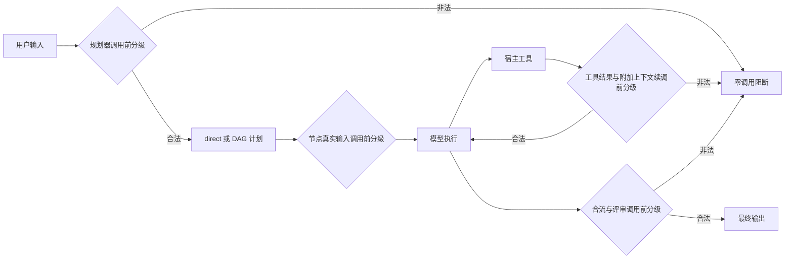

# 安全约束下的信息流与信任域合同

本合同对应 Issue #111。它把安全可行性设为 direct 与 DAG 路线共同的硬约束，随后才在
合法路线中比较质量、费用和端到端时间。费用、质量或速度收益不能抵消一次非法数据流。

## 决策顺序

1. 对即将发送的真实视图分级，并求出允许接触该视图的模型集合。
2. 不存在合法模型时 fail closed，不发起该次模型调用。
3. 在合法集合内满足用户质量门槛。
4. 在达到质量门槛的路线中先降低模型调用总费用，再降低端到端时间。
5. 只有 DAG 的模型价差、并行收益或安全放置收益足以覆盖规划、重复上下文、合流和质量
   风险时，才选择拆分。

## 部署域与信任语义

| 部署域 | 边际价格 | v3 `live` 敏感材料 | 说明 |
| --- | ---: | --- | --- |
| `local` | 0 | 允许 | 真实本地运行时 |
| `trusted-cloud` | 声明价格 | 允许 | 必须引用用户配置的 `trustPolicy` |
| `external-cloud` | 声明价格 | 禁止 | 外部公开云端 |
| `cloud` | 声明价格 | 禁止 | v1/v2 兼容名称；v3 应使用明确名称 |
| `simulated-local` | 0 | 禁止 | 只模拟本地成本，不提供真实安全保证 |

`trusted-cloud` 不能根据 provider 名称、URL 或厂商自动推断。其策略必须明确声明数据驻留、
审计日志及允许敏感数据。当前版本把这三项作为准入证据，后续可以扩展证明材料与到期时间。

`simulated-local` 只在 `security.dataMode` 为 `synthetic` 或 `desensitized` 时可承载命中的
敏感样本；它仍可用于研究价格与调度，但报告必须与真实本地证据分层。

## 端到端检查点

检查视图包含用户输入、节点任务、上游交接字段、工具结果和宿主附加上下文。规划期静态
判定不能替代运行期判定；新内容进入请求时必须重新检查。状态化工具对话一旦需要跨信任域
迁移就直接阻断，因为不同 provider 的工具调用 ID、推理状态与重放协议不能安全拼接。

## 审计与失败语义

安全运行的持久化证据只保留：模型与部署域、阶段、分级、命中规则名、字节数、调用与结果
SHA-256、阻断原因和状态。请求正文、工具参数、工具结果及附加上下文不写入运行记录。

确定性规则命中时记为 `S1`；本地分类器无法判定、不可用、失败或视图超限时记为
`unknown`。`S1` 与 `unknown` 都只允许 `local` 或经过显式策略授权的 `trusted-cloud`。
没有合法候选时使用 `privacy-route-blocked` 兼容状态，并记录具体检查阶段。

## v3 配置与迁移

完整示例见
[`data/schema/refractagent-providers-v3-example.json`](../data/schema/refractagent-providers-v3-example.json)。

- v1/v2 继续按历史语义编译，以保证冻结实验可重放；不会自动升级并改变旧证据。
- 新研究与产品配置使用 `refractagent-providers-v3`。每个 provider 必须显式声明
  `deployment`，安全检查始终启用，不提供关闭开关。
- v2 的 `privacy` 迁移到 v3 的 `security`；移除 `enabled`，并明确 `dataMode`。
- 原 `cloud` 应迁移为 `external-cloud`。只有用户建立 `trustPolicies` 并引用后，才可改为
  `trusted-cloud`。
- 原 `simulated-local` 在真实数据模式下必须迁移为真实 `local`、合法 `trusted-cloud`，
  或只使用合成、脱敏材料。

## 当前边界

确定性规则只能覆盖已知模式，不能证明未命中内容一定公开。启用分类器时，分类器本身必须
位于真实本地或符合策略的受信域。本文档冻结的是准入与信息流合同；本地模型质量、受信云
证明真实性及三条基准路线的经验结果由 #112 验证。
