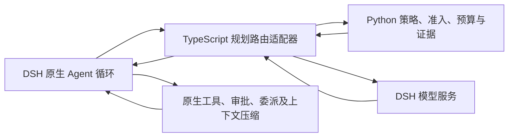

# RefractAgent 规划路由

## 定位与入口

新增 `refractagent/planning`（RefractAgent 规划路由），与自动路由及历史入口并存。
默认策略为 Stage。该入口保留 DSH 原生 Agent 循环，逐次请求 Python 决定模型、
审核及交付；不调用 DAG planner，不建立单节点图，不使用内部工具执行桥。

原 DAG 研究、节点选模、历史证据及自动路由额度保持独立。
规划路由没有 LiteLLM、Switchyard、Rust 或 PyO3 运行时依赖。
本次交付范围为 P0—P5；P6 的父子共享预算和子 Agent Task 策略仍是独立后续工作。



## 文件与职责

| 文件 | 职责 |
| --- | --- |
| `src/refractrouter/planning_config.py` | 版本化配置、角色、价格、信任域及零调用策略目录 |
| `src/refractrouter/planning_model_metadata.py` | 按宿主容量与已核对的实际路线档案查询模型资料 |
| `src/refractrouter/planning_policy.py` | Stage 信号、宿主工具事件归一、固定与随机选择 |
| `src/refractrouter/planning_runtime.py` | 冻结任务、六类策略状态机、预算包络及证据 |
| `src/refractrouter/planning_worker.py` | 无网络 NDJSON 工作进程 |
| `src/refractrouter/task_budget.py` | 原子预留、派发、实际用量结算，与 DAG 共用 |
| `validation/dsh/plugin/src/planning-routing.ts` | 工作进程生命周期、原生模型流与代理 replay |
| `validation/dsh/plugin/src/planning-config.ts` | 浏览器与宿主共用的传输类型 |
| `validation/dsh/plugin/src/client/planning.tsx` | 策略控件、独立设置分区与路由轨迹 |
| `tests/test_planning_routing.py` | 无网络策略、预算、隔离、恢复验收 |
| `validation/dsh/plugin/tests/planning_routing_contract.test.ts` | 真实 Python 进程与模拟宿主的端到端合同 |
| `validation/dsh/plugin/scripts/planning-fixture.ts` | 不随安装包分发的离线界面验收模型与工具 |

TypeScript 不计算路由分数或费用，也不执行规划路由产生的工具。
所有被接受的原生工具块返回 DSH。宿主继续拥有工具权限、审批、会话及后台委派。

## 配置与界面

「设置 → 插件」分别显示「RefractAgent 规划路由」和「RefractAgent 自动路由」卡片。
规划路由卡片把通用运行设置、模型与角色、策略设置、数据与历史兼容分开。
模型通过同一 DSH 模型目录引用 provider/model，不复制密钥。
角色为 efficient、capable、classifier、advisor；
允许多个角色引用同一模型。Static 只需要 efficient，Stage 不需要 classifier。

最低配置结构：

```json
{
  "schemaVersion": "refractagent-planning-v2",
  "enabled": false,
  "defaultStrategy": "stage",
  "billingUnit": "CNY",
  "maxProductionCost": 1,
  "maxProductionCostByUnit": {"AFP": 0, "CNY": 0},
  "timeoutMs": 300000,
  "maxCalls": 128,
  "models": [],
  "roles": {},
  "parameters": {},
  "compatiblePairs": []
}
```

示例预算仅说明字段，不会自动写入或启用用户配置。生产预算、任务期限和最大调用数
分别使用 `0` 表示无该项规划路由上限；费用仍逐次记账，宿主取消和提供方限制继续生效。
真实执行前，相关模型仍须有容量和实际计价资料。
模型选择后，插件从 DSH 目录读取可选推理等级，从宿主模型适配器读取容量，
并请求 Python 核心查找带来源的路线价格。DeepSeek 官方路线直接使用官方人民币
价格，按北京时间工作日峰谷时段计算；调用前使用高峰价格作为预算上界，实际扣费以
提供方账单为准。其他直接提供方的 USD 价格可按冻结汇率
折算为 CNY 预算价；明确使用 `/api/plan/v3` 的 Ark Agent Plan 路线可采用 AFP 档案。
Ark 普通路线的原厂参考价不作为实际 AFP 或人民币账单价。
缺少可核对资料时显示待核对，不以猜测值或 0 填充。

### AFP 与人民币预算

`refractagent-planning-v2` 允许每个模型绑定 `billingUnit`，并用
`maxProductionCostByUnit` 设置 AFP 与 CNY 生产预算。USD 字段保留为旧配置兼容项，
设置页不再显示 USD 预算或允许新模型选 USD。插件查询实际路线价格：先采用精确模型与
provider 路线对应的官方 CNY 价格；缺少官方 CNY 价时，将可核对的 USD 价格按冻结汇率
折算为 CNY。Ark Agent Plan 仍以 AFP 计量。旧配置的 USD 价格与预算在运行时按冻结汇率
转为 CNY；历史运行记录不改写。缺少所需 AFP 或 CNY 预算时，相关策略在派发前阻断。
`0` 明确表示该单位不限额。

任务账本按 AFP 与 CNY 记录每次调用的预留、已结算和待核对值。复合策略开始前分别检查
所需单位的完整调用包络，任一单位不足即零派发。现金与 AFP 不相加；调用数与期限仍为
任务共用上限。未知用量、取消与进程中断保留原单位证据，不自动重发。USD 来源的折算
汇率、来源和日期随调用账本保存。

现有配置使用 AFP 执行模型时，直接提供方模型另计 CNY 预算；若价格或单位资料无法核对，
所需策略继续阻断。旧历史中以 CNY 标记、但价格与
Ark Agent Plan AFP 系数相同的记录只显示单位待核对，不改写原始证据。

缓存读取与写入分开计价；发生缓存写入而未配置写入价格时停止并保留预留，
不会将其当作普通输入虚报成本。价格为 0 表示明确确认零费用，缺价不是 0。
可信云需要具名、有效、允许敏感数据并启用审计的信任策略；
真实本地与外部云分别声明。所有角色都经过实际输入的数据域检查。

会话模式在原生模型菜单的「路由模式」项中选择，交互与选择推理等级相同；
对话输入区不注册策略控件。插件设置中的策略是新会话的默认值，
模型角色、预算和具体参数在独立的「RefractAgent 规划路由」卡片配置。
设置页沿用自动路由的卡片与控件样式，按当前策略展示适用参数。
零调用检查显示各策略的配置缺项。

会话已选择 `rr:*` 时，新任务优先使用该模式；未选择时使用
`planningRouting.defaultStrategy`。已启动任务继续使用冻结配置。
物理模型推理等级始终取角色配置。
「路由轨迹」与「任务 DAG」独立页签共同注册。

## 六种策略

| 策略 | 行为与默认参数 |
| --- | --- |
| Static | 固定 efficient；高级随机按冻结权重和 seed 在每个任务开始时选一次，工具续接保持同一模型，默认两档权重 1 |
| Stage | 最近 3 条有效工具证据、阈值 0.5、强模型保持 2 轮；无信号使用默认高效模型 |
| Task | v3 从有序模型池选择一次；单一合格候选直选，多候选使用一次 LLM 或本地 Judge；不确定时只使用指定备援 |
| Composite | 一次 Task 形成默认档位，再逐轮 Stage；普通续接不重复分类 |
| Advisor | efficient 执行，结束轮审核；默认最多审核 1 次、返工 1 次；停滞审核默认关闭 |
| Escalation | 高效输出后判别，连续 2 次升级判断后丢弃当轮弱回复，强模型接管并锁定当前任务 |

Advisor 支持 APPROVE、REDO、无法判断。无效结果不会当作批准。
默认一次审核后如要求返工，返工结果标为「未复审」，不得描述成已通过审核；
调大审核次数后可继续在剩余上限内审核。审核次数耗尽或无效判别按记录停止，
不在后台无限循环。

Static、Stage、Task、Composite 选模后可流式输出；
Advisor、Escalation 逐候选缓冲，单次最多 8 MiB。
判别调用、被丢弃的输出、返工及强模型接管全部计入 production，
不混入实验 evaluation。已经发出的流式正文不会被后续策略替换。

## 与固定 Switchyard 实现的关系

参考提交为 `c6e5958a663a879541f4674744b52be6cb969fe6`；
源码位置与哈希见 [固定调研证据](../reports/switchyard-research-20260923/README.md)。

独立实现保留了固定／随机对照、Task 能力边界、Stage 有符号信号与保持、
Task+Stage 组合、结束轮审核及连续升级锁定机制。没有复制上游执行循环。

明确差异：

- DSH 会话、Agent、轮次是任务身份；不使用首条用户消息哈希。
- Stage 优先配对原生 tool/call、tool/result；按结构化错误来源分类。
  正文“成功”“失败”不决定分数。单次测试失败与正常检索不会直接触发强模型。
- 缺少错误来源的结果记作 unclassified-error，不臆测为任务能力失败。
  明确拒绝不升级；执行结果未知、派发后中止会阻止后续受管调用。
- 重复结构化错误优先于保持；其次处理保持，再比较有符号信号与阈值。
  默认保持 2 轮包含触发升级的当前调用和下一次调用，不会额外执行第三次强模型。
  已消费证据 ID 最多保留 128 条；旧的重复失败不会因后续无关事件再次触发升级。
  当前简化分数为 `tanh(0.5 × (severity / 0.7 + spinning - production / 0.7))`。
  不把持续检索自动判为空转。默认数值未经收益实验校准。
- Task v3 判别输出不合法时停止，不自动修复或重复调用；正常不确定才检查指定备援。
  Composite 仍维持既有两档判别合同，后续升级另行验收。
- Prefill、任意策略编排、在线训练及全局子 Agent 预算不在本轮实现中。

## 进程协议与任务状态

执行 `refractagent planning-worker --runs-dir PATH`。
协议版本 `refractagent-planning/3`，UTF-8 NDJSON，单条上限 16 MiB。
每个请求带唯一 id、protocol、op；响应回传同一 id、ok 和 result／error。

| 操作 | 结果 |
| --- | --- |
| preview | 零模型调用配置诊断与策略可用性 |
| begin | 以真实 session/agent/turn 冻结配置、策略、角色与预算 |
| step | 接受当前原生消息、工具及当前轮事件；返回 call 指令 |
| complete | 实际回复、用量与结束状态结算；返回下一 call、release 或 stop |
| query / history | 当前任务详情／会话最近 20 条去除原始提示的轨迹 |
| cancel / end | 停止后续派发；在途调用保留预留或继续结算真实回执 |

同一任务最多一个策略流程在途。工作进程串行处理请求并以锁保护状态。
不同任务具有独立账本，可交错完成物理请求。
工具续接和本轮追加指导复用任务；新用户轮次建立新状态。
上下文压缩单独记用途，不消耗 Stage 保持或执行步数；
独立压缩使用宿主 compactionId，不伪造用户轮次。

工作进程归插件生命周期管理；退出或协议超时不会自动重启并重放请求。
宿主调用无自动重试，策略接管与传输错误分别处理。

## 历史、预算与恢复

原生消息保留系统指令、工具定义、调用／结果配对。首版只接受文本与原生工具，
嵌套图像或未完成工具对也会在零派发准入时被拒绝。宿主管理上下文压缩，
插件不私自裁剪历史。

每条虚拟 assistant 回复携带版本化 `refractPlanning` replay 包络，
包含真实 provider/model、底层响应 replay、逐块 replay 和 runId。
恢复时逐条解包，不能把历史来源改成当前选模。
跨模型历史需要 `compatiblePairs` 的有向验收声明；未知组合停止。
旧虚拟历史缺少来源信息时给出明确诊断，不捏造来源。
原 DAG 工具桥新增 `_dsh_source`，新记录保留实际来源；
无法证明来源的旧纯文本记录使用插件来源，不伪造模型及不透明 replay。

每个真实调用依次经过输入检查、模型准入、原子预留、派发、结算。
Stage 先决定本轮目标模型，再按实际请求输入和该模型输出上限预留；未被选择的模型不占用预算。
强模型被选中但对应单位余额不足时停止并说明目标模型，不会静默降级。
包含审核或判别的多调用策略仍在开始前核对必要调用包络，避免执行预算挤占必须完成的审核。

证据位于 `runsDir/planning/<identity-digest>.json`，目录 0700、文件 0600，
原子替换前 fsync。记录配置、状态、全部费用、真实来源和被丢弃回复。
原始提示和工具数据只在本机证据；界面 history 查询移除这些字段。
生产环境应按实际数据域制定运行记录保留周期。

未知用量保留预留并停止；取消后仍可结算已经返回的真实用量。
相同任务身份若只存在磁盘证据而内存状态已丢失，禁止自动重发；
历史视图显示待核对中断状态。当前恢复流程为核对证据后开始明确的新用户轮次，
没有自动重试可能计费或产生副作用的操作。

## 子 Agent 与后续研究

宿主已开放的委派工具保持可用。继承 planning 的子 Agent 使用真实子会话身份，
固定 efficient，独立状态与记录；不继承主 Agent 的升级锁或 Stage 保持。
显式配置普通宿主模型的子调用仍遵循宿主设置。
主任务预算不宣称覆盖这些子任务的总支出，界面明确展示覆盖范围。

P6 后续增加根身份、原子共享额度、子 Task 策略、后台结算和根取消联动。
在此之前，不把本入口的额度描述为含所有委派的全任务硬上限。

## 验证与发布

执行：

```sh
uv sync --frozen --extra dev --extra deepagents
npm ci --prefix validation/dsh/plugin
npm run --prefix validation/dsh/plugin typecheck
npm run --prefix validation/dsh/plugin test
uv run pytest
```

契约测试通过只能说明离线行为与集成合同成立。
发布另行核对 Python 安装包、插件 tarball、实际安装版本和浏览器界面。
运行记录见 [本次验收](../reports/planning-routing-20260923/README.md)。

Stage 首轮三路线协议已冻结在
[stage-routing-v1.json](../data/benchmarks/stage-routing-v1.json)，包含 6 个代码任务、
6 个冻结资料研究任务、每路线两次重复和 72 次交错执行顺序。默认命令只产生零调用预检：

```sh
uv run python experiments/run_stage_routing_study.py \
  --output-dir reports/stage-routing-preflight-YYYYMMDD
```

真实批次需要另行确认协议指纹与 production／evaluation AFP 双预算；功能完成不以首轮实验必须
证明省钱为条件。完成该对照后再消融 Task、Composite、Advisor、Escalation；分别冻结允许／禁止委派组。
报告成功率、所有尝试的单位成功成本、首字及总时延、判别开销与换模比例。
轨迹回放不证明换模后的收益。回滚时关闭 planningRouting.enabled，
保留配置、证据及自动路由。
