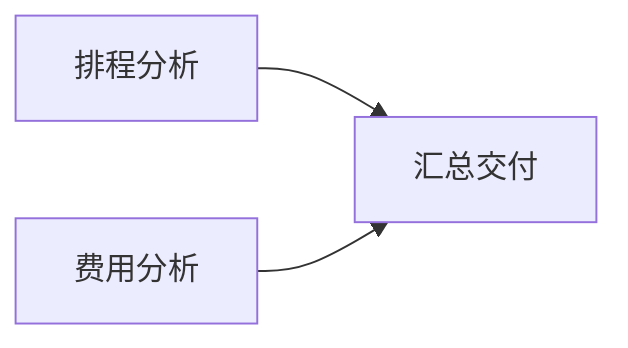

# 自动 DAG 应用验收

**自动规划 → 节点执行 → 最终交付的链路已在独立安装包中跑通；本轮没有证明内容始终正确或综合收益成立。**

最后一批包含三个未参与调试的任务、六条执行路线，17 次真实调用全部结算，共 17.2104 AFP。
全部路线获得模型评审，但后续内容复核发现展览任务存在错误依赖，不能称为三项任务均通过内容验收。

## 新任务结果

费用包含本次规划、节点执行和最终评审；时间为核心完整墙钟时间，包含规划。
直接模式与自动模式采用相同材料、模型池、策略、质量阈值、输出上限及预算。

| 任务 | 模式 | 实际节点 | 模型评分 | 规划 AFP | 执行 AFP | 评审 AFP | 合计 AFP | 总时间 |
|---|---|---:|---:|---:|---:|---:|---:|---:|
| 参与者筛选 | 自动 | 1 | 100 | 1.35630 | 0.47795 | 0.82800 | 2.66225 | 21.92 秒 |
| 参与者筛选 | 直接 | 1 | 100 | 0.00000 | 0.34705 | 0.90700 | 1.25405 | 13.48 秒 |
| 资料申请审核 | 自动 | 1 | 100 | 1.35410 | 0.48950 | 0.89700 | 2.74060 | 23.76 秒 |
| 资料申请审核 | 直接 | 1 | 100 | 0.00000 | 0.35860 | 0.88300 | 1.24160 | 14.54 秒 |
| 展览排程与费用 | 自动 | 3 | 100 | 2.05095 | 2.21485 | 1.66300 | 5.92880 | 54.29 秒 |
| 展览排程与费用 | 直接 | 1 | 92 | 0.00000 | 0.91410 | 2.46900 | 3.38310 | 40.34 秒 |

前两项自动规划保留单节点；展览任务自动形成下图，实际并发峰值为 2，两条交接逐字段核对通过。



生产节点和规划均使用 V4 Pro，最终评审使用独立 Kimi-K3。配置声明的质量预测只允许 Pro 满足 80 分下限，
所以本轮验证了自动拆分执行，没有验证异构分配收益。所有配置画像仍是零观测的用户预测，未改写为实测画像。

## 内容复核发现的误判

展览材料中 C 在第 0 天独立开始，A 与 C 没有依赖。C 延误两天后，真正决定工期的链是 **C → D → E**，总工期 9 天。
自动答案却写成 A → C → D → E，独立评审给了 100 分并通过。直接答案也曾写出 A → B → C → D → E，随后自我修正，模型给 92 分。
两份答案都不能当作无误交付。原始分数和答案保留，不事后改分；[内容复核](analysis/content-review.json) 单列计算与矛盾。
这是最终正文及模型评审的可靠性限制，与运行器的三个节点是否实际执行分别判断；不把进程或评审通过等同于内容正确。

## 工程变更与验证

- 正式应用增加 `auto`，CLI 和 DSH 均传给 Python 核心；默认 `single` 保持不变。
- 规划器获得能力、容量、预算与调度信息，默认使用声明能力较高的模型；支持一次结构修正，完整计费归档。
- 自动计划按真实节点重新匹配配置预测；输入容量和预计用量分开，实发请求仍受原有硬预算约束。
- 整张图在首个节点调用前检查容量与候选，防止已知无解的汇总节点造成前置费用浪费。
- 649 项完整测试通过，包含容量误作预计费用的回归；插件 56 项契约测试通过。
- [独立安装核对](analysis/installed-core-v5-check.json)：安装包中的 61 个 Python 源文件与冻结源码一致，新任务使用安装包运行。
- [最终审计](analysis/v5-holdout-audit.json)：51 个原始文件、17 次调用、两条实际交接核对通过，无未知用量或 HTTP 重试。

## 开发与失败证据

| 批次 | 结果与边界 |
|---|---|
| v1-development | 短任务选择单节点，两条路线执行通过；自动模式增加规划费用和等待时间。 |
| v2-development | 生成三节点，但把最大容量当作预计用量导致费用约束拒绝；真实费用保留。 |
| v3-development | 修复预测口径后，三节点实际执行并交付。 |
| v3-holdout | 通知任务完成；采样任务规划返回非法 analysis 类型，停止批次，展览任务未执行。 |
| v4-development | 将采样任务转入开发集；一次修正修好了类型，但遗漏输入契约错误，仍停止。 |
| v5-development | 更换默认规划选模并补充交接格式说明后，采样任务的三节点执行通过。 |
| v5-holdout | 使用新筛选、新申请审核及此前未执行的展览任务；执行链完成，内容复核仍发现展览错误。 |

v3-holdout 的采样结果没有重跑后混回留出；v4-holdout 仅有零调用预检，不计作一次实测。
所有实际批次合计 **47 次调用、38.51785 AFP**，无未知用量。开发与先前失败共 30 次调用、21.30745 AFP；
最终留出为 17 次调用、17.2104 AFP。[全量账本汇总](analysis/total-usage.json) 保留每批分项。
这些是目的性虚构封闭案例，不是用户业务抽样；不统计总体成功率、不宣称普遍节省费用或时间，也不替代 #40 的真人复核。

同一份三节点计划的可复算反例：[容量与费用预测](analysis/capacity-cost-replay.json)。
容量误作预计用量时为 48.2163 AFP，分开计算的预测为 16.5715 AFP，执行实际为 1.683 AFP；硬预算仍为 40 AFP。
预测仍明显保守，未宣称已经准确校准。

## 复现

```bash
uv run python experiments/audit_automatic_dag_acceptance.py \
  reports/automatic-dag/v5-holdout-actual --output /tmp/automatic-dag-audit.json
```

使用方式见 [自动拆分与执行](../../docs/automatic-dag.md)。下一步质量工作应补强正文事实核对和评审校准；
没有执行中的动态再拆、工具动作或全面真人验收。
