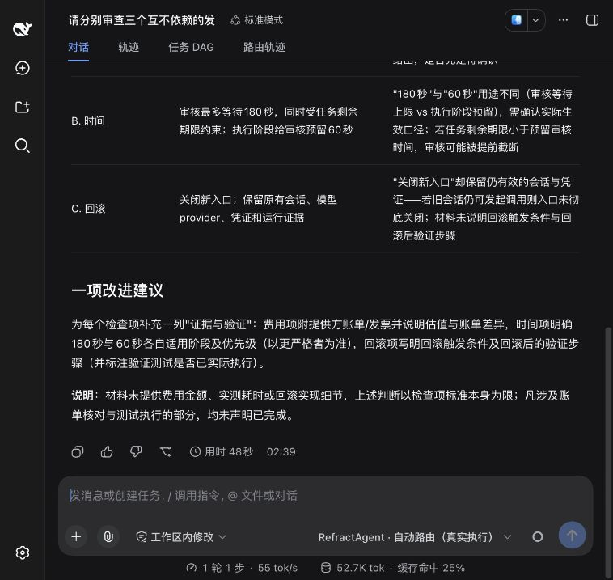
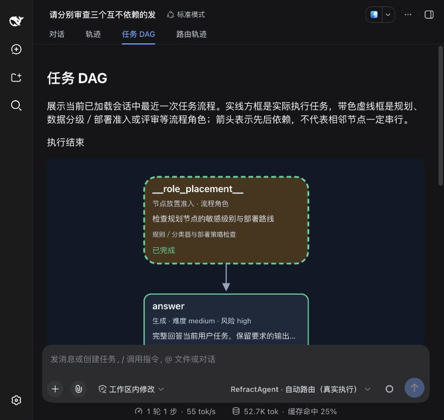

# 自动路由最终审核与纠正验收

## 结案范围

核心 `0.16.20`、插件 `0.33.4` 已安装到用户原有 DSH web profile。
原六个公开材料任务的 Direct／DAG 共十二条路线均有通过记录：完整批次通过九条，
另外三条经格式修复后的定向复验通过。不是同一批次十二条全通过；旧失败和费用不改写。

通过要求保持原样：冻结事实字段正确、解释非空、最终审核逐项通过且评分至少 80。
事实检查只验证指定字段，正文及建议由模型审核，不把它解释成人工独立复核或普遍准确率。

数据见 [验收摘要](acceptance.json)，实现与设置见
[最终审核与一次纠正](../../docs/automatic-final-correction.md)。

## 原因与修复

| 已观察问题 | 修复 |
|---|---|
| 执行器把材料未提供的验证状态写成系统未经验证，或给出反向时间因果 | 原始执行与纠正都明确来源、条件与事件顺序；审核核对整份正文及定位的事实句 |
| Judge 改写长原文、JSON 转义不一致，造成合法回复无法结算审核 | 核心保存原文和哈希；Judge 只选证据编号，核心恢复展示文字 |
| Judge 心算错，将已经独立核对的 295 建议改为其他数值 | 可信校验回执绑定当前候选，只确认指定答案字段；解释、其他计算和建议继续独立审核 |
| 总体审核未选摘录编号，或多出 `check-id:null` | v9 明确总体范围为整份候选；完整规范字段旁的多余空别名可以有记录地删除，不推测判定 |
| 回复正确性被拒绝后无法修正 | 显式开启一次最终纠正，保护执行及必要复审额度；只复审通过后交付，不重做规划、节点或工具 |
| 后端结束失败，DSH 页面仍显示运行中 | 自动路由改用宿主支持的纯增量输出，不再发送会在历史重放中撤回节点的空块 |

非法判定、伪造编号、事实无来源、矛盾判定、认证、传输及未知用量继续停止。
没有降低质量门槛，没有 HTTP 自动重试，也没有用新的额度替换诊断。

## 真实路线记录

| 批次 | 范围 | 通过 | 实际模型调用 | 参考估值 CNY | 按量现金 CNY |
|---|---|---:|---:|---:|---:|
| `natural-six-02` | 原六题 × Direct／DAG；旧长引用回执 | 6／12 | 39 | 1.4839284375 | 0 |
| `natural-six-03` | 同六题；证据编号与独立字段回执 | 9／12 | 41 | 1.6220799806 | 0 |
| `natural-targeted-04` | 仅三条格式失败路线，使用 v9 | 3／3 | 13 | 0.4571404308 | 0 |

三条定向复验如下；原完整批次的失败仍存在，不合并为新的完整批次成功率。

| 任务 | 路线 | 调用数 | 审核评分 | 纠正 |
|---|---|---:|---:|---|
| 工具回执 `tool-receipts` | Direct | 2 | 92 | 不需要 |
| 取消与预留 `cancel-reservations` | DAG | 5 | 95 | 一次纠正后复审通过 |
| 费用与工具证据 `independent-cost-evidence` | DAG | 6 | 95 | 一次纠正后复审通过 |

其余九条保持各自完整批次的成功证据。两条 `request-envelope` 路线及
发布审查 DAG 在完整批次中也触发一次纠正并成功，事实失败不能被模型高分覆盖。
本批没有工具或委派，Direct／DAG 是冻结的对照路线，不冒称自动入口必然选择 DAG。

采用现有五款模型池。实际执行为 Ark `deepseek-v4-flash` low，规划为 Ark `glm-5.3`
提供方默认，最终审核为同路线 GLM low。规划／审核输出各 8192，执行按目录容量，
任务五分钟、审核等待 180 秒，模型参数与成功判据在批次中没有变化。

定向批次冻结最多 24 次调用、现金和参考估值各 10 CNY 硬上限；实际 13 次，
没有未知用量。费用包括被丢弃候选、规划、审核和纠正，订阅估值不当作额外扣款。
预检核对累计 100 CNY 授权，历史现金与独立 Jev 保护共 1.40182036 CNY；
未将旧订阅未知参考预留冒充现金，也未取消历史预留。

## 错误与合格回复对照

`v9-grounding-pair-01` 复用同一完整原 DSH 上下文及原两例人工标签。
条件化的反向时间因果回复被拒绝，限定材料范围的修正版批准，2／2 符合预期。
两次审核耗时分别 9.900、10.626 秒，参考估值 0.0797930686 CNY，按量现金为 0。
没有第二 Judge、修复审核调用或阈值下调。旧 v7／v8 对照记录保持原样。

## 原 DSH 实际界面

在原 profile、原工作区发起一条公开发布审查任务，未强制 Direct／DAG、未改模型池：

- 运行 `20261008T183858Z-b2a833092277` 正常交付；核心端到端 46,728 ms，宿主显示 48 秒。
- 三次模型调用，审核评分 92、v9 通过；没有工具调用、未知用量或再次派发。
- Jev 判断独立工作可拆；Python 规划后比较费用，实际选择整任务 Direct，轨迹区分两者。
- 执行／规划参考估值 0.0581892631 CNY，审核参考估值 0.0420281713 CNY，合计
  0.1002174344 CNY；按量现金为 0。独立 OpenRouter Jev 约 779 ms，现金估算
  0.0002498951 CNY 单列，不假称提供方账单已核对。
- 路由轨迹显示全部五款配置模型、选模依据、真实推理等级、费用与两项整份回复审核。
- 原任务 DAG 节点及箭头、独立规划路由／自动路由设置卡片均可见。

人工复查这条发布审查：未把缺少验证材料断言成系统未经验证；区分 180 秒等待和
60 秒预留用途；交付表格与一项建议；未宣称核对账单或执行测试。
任务设置不限时，因此运行中实际预留时间为 0，原设置中的 60 秒仍保留，未伪称已扣除。
原设置中的审核 low、180 秒等待、8192 审核输出及现金 5／1 CNY 也保持不变。

最终正文见 [公开任务结果](dsh-answer.md)。

## 构建与安装核对

- 完整 `uv run pytest`：1975 项通过，217.68 秒；包含 DSH 契约回归。
- TypeScript 严格类型检查、插件构建和打包通过。
- 安装包、已安装核心的 137 个源码文件、插件的 39 个分发文件逐项相同。
- 安装前后原设置及凭证逐字节一致，不创建隔离 profile，不删除会话或 provider。
- wheel SHA-256：`c933b6d6e4f7631da400c36d8cecd453bedd647bc119bc343a2f0eadb499d1b0`。
- 插件包 SHA-256：`4deb92d3b835cbf09c76eb5941079d12f08691422a01f212116f4427492191d9`。

完整请求、原始回复、推理、账本、备份及调用身份留在私有审计目录，未提交凭证、
完整宿主上下文或环境配置。公开摘要保留批次冻结摘要及各结果哈希。

## 验证边界

这是文本任务、审核合同、纠正闭环、费用与原 DSH 安装路径的有限验收。
没有据此宣称 DAG 普遍节省费用、所有模型建议正确、媒体或其他客户端本轮已验收。
标准模型接口仍由接入 Agent 执行工具和推进任务，未加入 Router 内部 Agent 循环。
