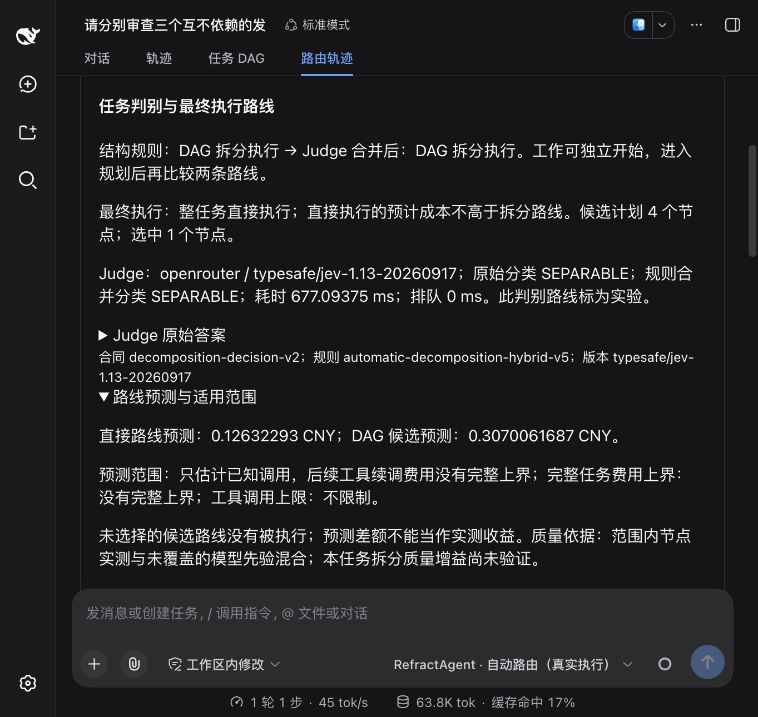
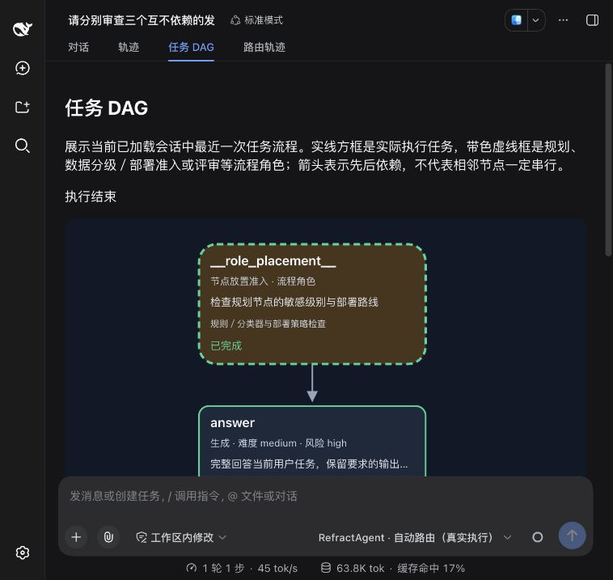
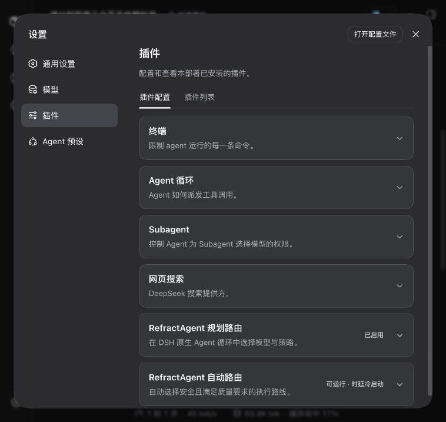

# 五模型节点档案与原生自动入口复查

## 交付范围

PR #193 已于 2026-10-09 合并，提交 `3b1d57efabac7547cf0ad9a096e9b9461ea5c951`。
后续工作依次完成五模型独立节点观察、带适用范围的档案激活和原 DSH 入口复查。
未强制拆分或多模型分配，也没有运行未被选中的 DAG 来制造收益结论。

最终版本为核心 `0.16.26`、插件 `0.33.11`，宿主仍为 `0.1.5-rc.3`。
标准模型 API、规划路由和自动路由研究入口的职责边界保持原样。

## 有限节点测试

题集为 `data/automatic-node-quality-cases-v3.json`。四个分层分别包含三条校准和一条保留：
提取（低难度／低风险）、综合（低／低）、核验（中／高）、交付（中／高）。
五条实际执行路线收到同一公开材料和原宿主上下文，共 80 次调用。
判定采用调用前冻结的字段及数值合同，没有生成式 Judge 或 HTTP 自动重试。

| 实际路线 | 通过／16 | 可用分层／4 | 调用中位耗时 | 参考估值 CNY | 新增现金 CNY |
|---|---:|---:|---:|---:|---:|
| DeepSeek 官方 `deepseek-flash` | 14 | 2 | 1,377.5 ms | 0.164944 | 0.164944 |
| DeepSeek 官方 `deepseek-v4-pro` | 15 | 3 | 5,399.5 ms | 0.7986126 | 0.7986126 |
| Kimi 官方 `kimi-k3` | 16 | 4 | 9,667 ms | 3.20332 | 3.20332 |
| Ark `glm-5.3`（提供方默认） | 15 | 3 | 2,639.5 ms | 0.151577067509 | 0 |
| Ark `deepseek-v4-flash`（low） | 15 | 3 | 4,983.5 ms | 0.36264 | 0 |

合计 **75／80** 通过，参考估值 **4.681093667509 CNY**，新增现金 **4.1668766 CNY**，
未知用量为 0。参考估值已包含按量现金，不把二者相加。以上耗时是本机本批观察，
不能作为 SLA，也不是跨任意任务的能力排名。

保留以下五个失败，不降低答案门槛或只重跑失败项：

- Pro 与 Ark Flash 的综合保留题错误计算现金占用：把独立的已释放预留再次从未知占用中扣除。
- DeepSeek 官方 Flash 的核验保留题未识别材料已给出的独立根节点并行证据。
- DeepSeek 官方 Flash 的一条交付校准题过度四舍五入，违反冻结的精确数值合同。
- Ark GLM 的交付保留题漏计按量现金对应的参考金额。

失败分层被否决；保留题只否决，不提高校准分数或拟合用量。
一条完整 JSON 代码围栏按预先冻结的语义政策解码，但原始格式不合规另列。
各调用的公开输出、用量、独立检查与摘要见 [原始结果](five-model-nodes.json)。
完整原宿主输入保持私有。

## 档案适用范围

档案摘要为 `21dcf9d73ade0283538925b87411f91343fa505369c2182321c4e440503ec5ce`，
包含 15 个可用分层和 5 个否决分层。用户原模型池只增加 `nodeProfilePath`，
原 provider、凭证、推理等级、单任务预算与会话没有迁移到新 profile。

`exact-task-v1` 登记十六条公开节点任务和原三项发布检查任务；未登记的任务不采用该档案
实测分数。登记任务也须匹配节点类型、难度、风险、输入区间及模型参数；缺少匹配时
明确使用未验证先验。同类已知失败不能因输入区间变化而被更乐观先验覆盖。

这批数值与结构题没有证明开放式发布审查、代码开发或研究任务一定正确。
原生入口复查确实发现了此边界：局部节点题通过不能代替最终回复验收。

## 原生入口发现与修复

在原 DSH web profile 中，用用户指定的三项独立发布检查材料新建会话复查。
真实路径包含 OpenRouter Jev、规划、路线比较、执行和最终审核。

首次入口记录 `20261009T043334Z-f631d07a1f2e` 的模型审核报 92 分通过，但独立复查不通过：

- 把执行阶段的 60 秒预留说成审核期间先到期的计时器。
- 把材料未说明验证状态写成「保留完整性未经验证」。
- 没有区分本次未核对账单与历史上未核对账单。

第二次记录 `20261009T045445Z-174854d8557e` 的时间解释已修正，但仍含省略主体的
「未验证回滚预案的可执行性」。审核报 90 分通过，独立复查要求澄清，未计为质量验收通过。
两次记录与原输出均保留，分别见 [首次复查](original-entry-before-time-fix.json) 和
[时间修复后的复查](original-entry-after-time-fix.json)。后者的新规则回放明确标为派生评价，
不是追改旧审核。

第三次记录 `20261009T050609Z-b237b206aee5` 按 v1 保守检查停止，发现规则误拦：
纠正候选的「本次未调用……；未核对……」在同一句内延续明确主体，却因分句丢失主体。
已确认用量正常结算，未派发复审、未交付未审定正文，也未自动派发第二次纠正。
v2 保留同句的主体延续，但不向下一句、表格或另一系统主体扩散。
原停止和新的零调用派生回放见 [归属保护停止记录](original-entry-attribution-stop.json)；
派生检查通过不代替该候选缺少的语义审核。

第四次记录 `20261009T053929Z-538a36a1e664` 发现 v2 仍误拦「本次也未……」及顿号并列。
v3 保留明确主体、常用副词和同句省略主体的并列动作；出现另一个主体或非并列动作后终止延续。
原记录与仅作归属检查的零调用派生回放见
[副词与并列误拦记录](original-entry-self-adverb-stop.json)。复审未派发，费用已结算。

新增两项有限保护：

1. 材料明确给出等待和预留时，阻断已覆盖的「预留到期截断审核」解释；不根据两个数值不同
   认定冲突，也不从运行配置替材料添加定义。
2. 材料限定任务中，已覆盖的否定验证措辞须明确本次主体、条件前提或匹配来源。
   归属不清先要求澄清，不推断系统实际未经验证。字面未匹配的同义改写也可能保守阻断。

保护只作用于显式开启一次最终纠正的新版自动入口；旧冻结协议保持原行为。
复用既有一次纠正与复审，未通过则停止；不重复执行工具或节点、不增加 Judge 链条。
审核合同 v10 强调风险表里的无来源事实不能因写成风险或警告而豁免。
保护覆盖有限表达，模型审核仍可能出错；无命中或检查通过均不代表整份答复已获证明。

## 费用和并行的解释

首次原任务的 Direct 预测为 **0.121302938243 CNY**，DAG 候选为 **0.270554938243 CNY**，
两者均含已发生的规划费及共用审核预测。独立 Jev 单列。
最终选择 Direct，实际含 Jev 参考估值 **0.133253360030 CNY**，新增现金约 **0.000249895120 CNY**。
调用为一次规划、一次执行、一次最终审核；原生模型均为订阅路线。

候选 DAG 含三个独立根节点和一个汇总节点，根节点可并行，但它没有被执行；
实际节点并发峰值为 1。候选根节点的风险分层没有被本批校准覆盖，仍使用先验，
不能声称它们已获得差异化实测质量保证。实际 Direct 交付节点匹配到小样本分层，
也不能因此保证开放式正文正确。

因此本次没有证明 DAG 实际更贵或更便宜，也没有为了显示异构而人为分配模型。
费用预测、安全预留、实际结算和未覆盖的质量依据在路由轨迹中分别展示。

## 验证与发布

完整 `uv run pytest` **2060 项通过**（251.68 秒），其中执行插件的 **237 项契约测试**。
TypeScript 严格类型检查与最终构建通过；真实入口复查结果见下述记录。
真实节点批与原入口复验分开记录；最多一次纠正的阻断、放行、失败、预算及取消使用无网络测试。
现金预检计入历史消费和未知预留，独立 Jev 另保守保护 1 CNY；本次有限原入口最坏现金
占用合计 **11.5777634496 CNY**，仍在既有累计 100 CNY 授权内，不修改日常额度。

最终安装逐文件核对 141 个核心 Python 文件及 41 个插件包文件。
设置、凭证与节点档案逐字节保留。真实复查结果、构建摘要及实际页面验收另见
[最终入口复验](original-entry-final-recheck.json)。

## DSH 失败显示兼容

实际失败回执暴露 rc.3 视图合同问题：`assistant-step` 与 `turn-process` 撤回已显示节点，
导致会话事件消费中断、页面仍显示运行中。插件只对带受控自动入口标记的投影保留同 key
隐藏节点，宿主继续处理失败；不改 Agent 状态、审核结论或重发调用。卸载恢复原函数，
普通模型和正常返回的宿主节点沿用原行为。

失败 attempt 的受控运行引用独立保存为会话位置数据，刷新后也能找到轨迹，不把未通过
正文伪装成助手成功回复。规划工作进程与档案发现使用同一宿主允许目录解析相对证据路径。
服务恢复原启动目录，原会话工作目录仍保持不变，没有复制或移动旧运行证据。
这些是 rc.3 集成兼容措施；不宣称修复了宿主所有视图定义。

## 最终原入口复验

记录 `20261009T055418Z-284c0c254893` 完成一次纠正与复审，原 DSH 正常交付，
模型复审报 95 分。独立复查通过本次针对的时间用途、材料状态归属及返工／结算检查；
不把该分数或有限规则检查当作完整事实证明。正文「未知用量……未定价」仍容易混淆
价格未知与费用待确认，措辞限制单列，原正文与原评分不追改。

- 真实调用为规划、执行、一次纠正、一次复审，共 4 次 LLM 及 1 次 OpenRouter Jev。
- 核心端到端 75,469 ms，DSH 显示 1 分 17 秒；模型首字时间未取得，不推算。
- Direct 预测 **0.126322930005 CNY**，DAG 候选预测 **0.307006168668 CNY**。
- 候选 DAG 分别用 GLM 检查费用、时间、回滚，再由 Flash 汇总；这是候选差异化分配，
  没有实际运行。部分分层仍为先验，本任务的拆分质量增益未验证。
- 实际选择 Direct，Flash low 生成与纠正，GLM low 复审；节点并发峰值 1，配置上限 3。
- 含 Jev 的参考估值 **0.130023404276 CNY**，新增现金 **0.000249895120 CNY**。
  四次 LLM 是订阅路线，现金为 0；未知用量为 0。

本轮全部 80 次节点观察、5 次原入口记录均计入，新增现金合计 **4.168126075598 CNY**，
参考估值合计 **5.221172672867 CNY**；不能相加，也不能把四个原入口失败从统计中删除。
失败引文归属的派生检查不冒充原复审结论。

原 DSH 实际页面已核对最终正文、五款候选、预测与适用范围、一次纠正和费用、
实际 DAG 节点与连线，以及规划／自动两张设置卡片。最后一条没有新会话消费错误。
失败引用在刷新后恢复；新补丁的实时失败投影由合同测试覆盖，没有为此额外制造付费故障。

详见 [最终复验记录](original-entry-final-recheck.json)、[原交付正文](final-dsh-answer.md)。

