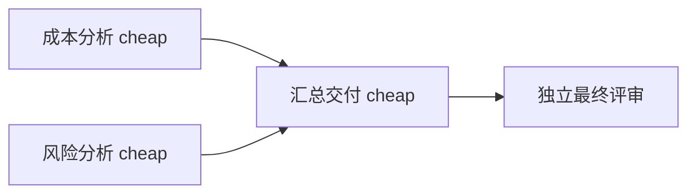

# Issue #32 真实 DSH 任务入口验收

已通过单个自然任务的真实宿主入口：DSH 助手 → 插件 → Python 自动 DAG 规划与校验 → A 节点选模 → 并行执行 → 最终独立模型评审。
最终版本 v7 得分 100、两项验收均通过，交付为直接中文正文。此结论仅针对本任务的集成可行性；
不构成自动规划泛化、真实异构交接或节点路由收益证明。代码与证据仍为本地未提交状态。

## 任务与实际拆分

输入材料：试点投入 24 单位、覆盖 4 组；全面推广投入 54 单位、覆盖 12 组。试点可按周调整培训，
全面推广要求上线前统一完成培训，但完成状态尚未确认。要求分别分析成本和风险，再给出有条件建议。
原始请求不包含 plan，两个验收条件由调用方固定，规划器逐项原样保留。

成本与风险节点无父依赖，分别直接使用原材料；汇总显式消费两者声明的字段。
三个节点均由 A 自动选择 `cheap`（`deepseek-v4-flash`），没有强制异构。迁移 profile 的适用范围未扩大。
最终核对：单位覆盖成本分别为 6 与 4.5 单位/组，保留总投入，培训状态作为条件，不编造收益或风险概率。

## 实际发现与修复

| 版本 | 结果 | 原因及处理 |
|---|---|---|
| v3 | 启动失败，零模型调用 | DSH 不接受只声明 off 的 reasoningEfforts 字典；隔离路由改为 false。 |
| v4 | 节点派发前失败 | 规划器为中文消息填写 2000 输入容量，无法容纳完整任务/契约/系统指令；已向规划器说明 UTF-8 字节数加 256 的保守计量规则和汇总余量。 |
| v5 | 82 分，语义验收失败 | 中间分析完成但最终只交付一段建议，漏掉要求分别呈现的分析；规划器现明确只有最终节点对用户交付，必须保留全部部分和顺序。 |
| v6 | 100 分，内容通过，展示待修 | 原文仍封装为 JSON 的 text 字段；文本节点改用专用正文指令，JSON 交接指令保持不变。 |
| v7 | 100 分，任务通过 | 直接交付正文；真实并发、汇总等待、独立评审与宿主展示均有原始证据。 |

各版本使用同一开发任务，不是独立测试样本，也不能据其比较成功率。每轮零自动重试，原始失败及用量全部保留。
输入容量约束与 AFP 费用预算不同；订阅制不取消上下文上限。本轮上下文传输由用户在明确询问后确认。

## 会话与时序核验

- 每个启动成功的 DSH 会话恰好一次 `refractrouter_task` 调用；完整 JSON 参数与冻结请求相同，无预设 DAG，无其他工具。
- 会话工具调用 ID 与返回对应；Python `invoked_by=dsh-plugin`，所有 runner 产物哈希逐项一致。
- DSH 助手会话、核心状态和最终评审分别核对；没有用进程退出码 0 推导任务成功。
- v7 实际并发峰值 2，分支重叠 2430.65 毫秒，汇总在两个分支结束后启动。
- 核心全流程 35316 毫秒，含规划和评审；宿主 turn 为 52259 毫秒，另有进程启动开销，见 process.json。这是单次时延，不能推导并行净收益或 p95。
- DSH 0.1.1-rc.2、插件 0.7.0、Node 22.22.3；隔离 DSH_HOME，workspace-write 沙箱，Agent Plan `/api/plan/v3`，未改日常 profile。

## 用量

| 版本 | 核心调用 | DSH 外层调用 | 核心生产 AFP | 核心评审 AFP |
|---|---:|---:|---:|---:|
| v4 | 1 | 2 | 0.10045000 | 0.00000000 |
| v5 | 5 | 2 | 0.24665000 | 0.73100000 |
| v6 | 5 | 2 | 0.28305000 | 1.10900000 |
| v7 | 5 | 2 | 0.24885000 | 1.13900000 |

合计 16 次核心调用、8 次 DSH 外层调用，启动失败轮次没有调用。核心已确认 3.858 AFP 估算，未知预留为零。
DSH 外层另计 5.94595000 AFP 估算，含缓存读入的完整用量；本轮合计 9.80395000 AFP 估算。
计量映射已按本机 DSH 和 pi-ai 源码核对，详情见 `accounting-summary.json`；上表仅列核心 AFP。
AFP 用于比较记账，订阅制下不直接解释为新增现金账单。没有与旧完整对照费用或成绩拼接。

## 回归与剩余项

完整回归 232 项测试、5 项子测试通过，包括执行 26 项 TypeScript 契约的测试，两者不重复相加。
新增离线重放实际容量失败与 82 分语义失败，证明节点完成或总分较高都不会覆盖失败状态。测试不发起网络调用。
`git diff --check` 通过。归档中的凭证值检查未发现泄露；仅保留环境变量引用。

Issue #32 第 7 项新增通过；第 1、2、3、5 项继续通过，第 4、6 项保持未完成。
完整多任务留出对照、真实异构交接和更广的分层 profile 覆盖仍需验证；旧留出样本已暴露，下一轮必须冻结新数据及对称单模型 A/B 基线。
本次仍依赖本地 Python 源码环境，不是独立 Router 服务，也未替代其他产品入口。
共享工具结构顶层 phase 仍沿用基准入口占位 dry-run；文本任务实际阶段以 task.mode=run 为准，付费用量已实录。

## 原始证据

- [最终中文交付](dsh-live-v7/runner/output/answer.md)。
- [会话与产物核验汇总](session-verification-final.json)、[完整测试日志](pytest.log)。
- `dsh-live-v4` 至 `v7`：完整会话、原始工具返回、runner 输入/输出/评审/费用及过程日志。
- 三份修复前源码归档与最终源码归档用于追溯未提交版本，`artifact-index.json` 记录当前源码及报告产物。
