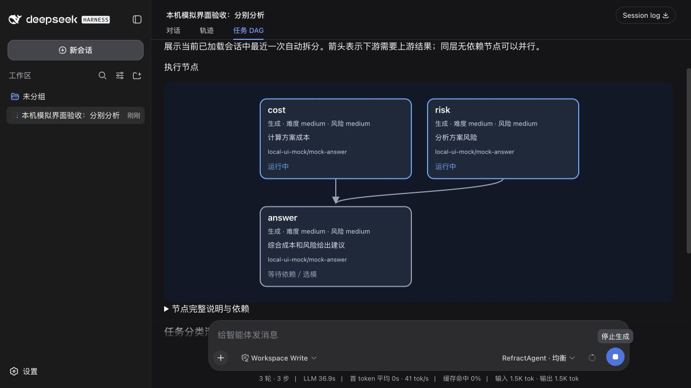

# DSH DAG 图验收

在独立分支 `codex/dsh-dag-graph` 实现 DSH「任务 DAG」客户端页签，保留原对话渲染器。
使用已有 Python 核心进度增加正式类型、难度与风险，通过受测试保护的插件展示格式
绘制 SVG 节点和箭头，不读取任务文件、不发起额外模型请求、不在客户端推断业务状态。

## 验证结果

- Python 完整测试：678 项通过，包含 62 项 TypeScript 插件契约测试。
- 新增客户端契约覆盖实时更新、依赖层级、动态替换、流式截断、非法边、环、
  历史回放与独立页签注册；核心测试验证正式类型、难度与风险来自实际计划。
- 本机 DSH 0.1.1-rc.2 使用模拟 HTTP 供应商执行任务，图中 `cost`、`risk` 同时
  显示「运行中」，`answer` 等待二者；结束后全部显示完成。
- 历史记录可以绘制已有依赖，缺少分类的旧记录显示「未提供」，不会按节点 ID 猜测。
- 纯本机模拟，没有外部付费模型调用；模拟结果不能作为路由收益证据。

下图为运行中验收截图；最终布局进一步将少节点层居中。

分类和使用说明见[节点分类与 DAG 图](../../docs/task-node-types.md)。
