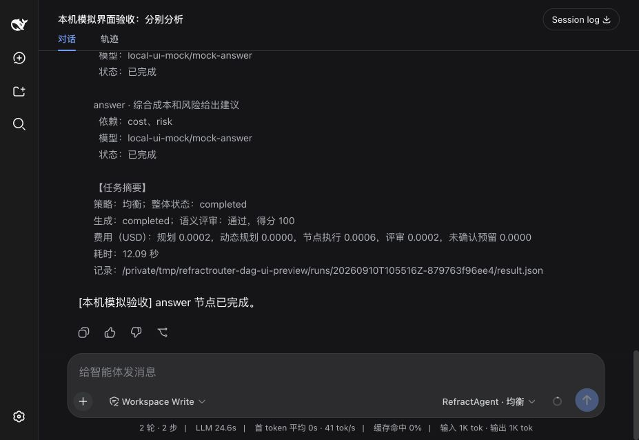

# DSH 自动 DAG 进度验收

本分支基于自动 DAG 实现 `64b45f8`（PR #49），补齐 DSH 模型入口的实时进度展示。
Python 核心在检查点生成节点快照，写入 `progress.ndjson`，通过 NDJSON 向插件推送；
插件只校验和展示节点、依赖、实际分配模型、执行状态及最终摘要。

## 验证

- `uv run pytest`：678 项通过，其中包含 59 项 TypeScript 插件契约测试。
- `npm run --prefix validation/dsh/plugin typecheck`：通过。
- `git diff --check`：通过。
- 确定性测试覆盖完成前收到运行状态、依赖顺序、动态拆分、失败阻断、取消进程、
  凭证脱敏，以及既有入口兼容性。
- 使用本机 HTTP 模拟供应商，通过实际 DSH 界面执行两轮任务；未调用外部付费模型。
  `cost`、`risk` 独立执行，`answer` 依赖二者；最终三个节点均完成。
- DSH 的 Think 区域按纯文本显示，因此采用节点条目和状态变化记录。
  最新界面验收耗时 12.09 秒，截图如下。

模拟响应、用量和费用仅用于集成验收，不是核心路由收益证据。
用户配置须设置 `refractagent.config.template="auto"`，重启 DSH 后提交新任务生效。

