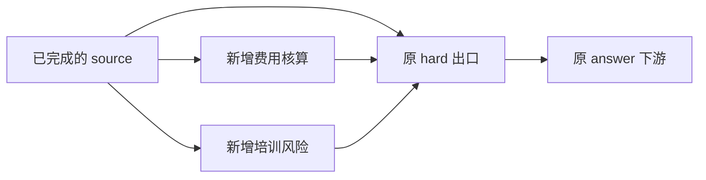

# 快速规划与动态执行验收

本次实现四项要求：小模型生成短计划、独立分支并行、确定性依赖检查拦截错误链、困难节点有界再拆。
真实调用验证了前述执行路径；**尚未证明拆分能整体提速、降低总费用或普遍提高答案质量**。

## 快速规划与并行结果

默认规划器为 Ark V4 Flash，最多输出 1200 tokens、总规划超时 12 秒。Python 补齐契约。
本轮两项自动任务都生成三个节点，实际并发峰值为 2；生产节点为 V4 Pro，最终评审为 Kimi-K3。
配置仍是零观测的能力预测，不是实测画像；本次不是异构执行收益实验。

| 执行 | 规划就绪 | 节点数 | 初始规划 AFP | 动态规划 AFP | 节点执行 AFP | 评审 AFP | 总 AFP | 总时间 |
|---|---:|---:|---:|---:|---:|---:|---:|---:|
| 展览回归，自动 | 4.39 秒 | 3 | 0.03890 | 0 | 2.84350 | 2.33300 | 5.21540 | 36.52 秒 |
| 新舞台排程，自动 | 1.99 秒 | 3 | 0.04375 | 0 | 2.85010 | 1.99200 | 4.88585 | 30.20 秒 |
| 舞台排程，直接补测 | 无规划调用 | 1 | 0 | 0 | 0.84535 | 2.04300 | 2.88835 | 26.23 秒 |
| 受控动态恢复 | 无初始规划调用 | 3→5 | 0 | 0.04235 | 2.67355 | 0.85000 | 3.56590 | 32.69 秒 |

总时间包含规划、执行及最终评审。自动模式的两个分析步骤确实重叠；例如新舞台任务：
排程在第 2.00–8.45 秒执行，费用在第 2.00–4.65 秒执行，汇总在第 8.46 秒开始。
但本次自动路线端到端比直接路线多约 3.97 秒，不能用局部并行代替整体效率结论。
直接补测发生在输入容量修复后的新冻结批次，不能把跨版本单次时差当作严格效应估计。

## 展览答案与模型误判

原始材料中 C 没有 A 前置条件。旧自动答案的 `A→C→D→E` 和旧直接答案中的错误链，
都已由历史原文重放回归拦截，不修改原始答案和评分。

新展览答案正确列出原始 `A→B→D→E`、8 天；C 延误后 `C→D→E`、9 天，
费用 4400 元、余额 200 元。舞台两种模式均正确给出原始 `X→Y→U→V`、11 天，
Z 延误后 `Z→U→V`、13 天，费用 3400 元、余额 600 元。
这些最终正文另经 Codex 逐项核对，见 [内容复核](analysis/content-review.json)；不是 #40 的真人签署。

确定性检查只覆盖受支持的显式排程句式、箭头依赖与关键链覆盖；不支持的材料标为未验证，
不把 `null` 当作通过。不声称已解决所有自然语言事实误判。模型评分不得覆盖确定性失败。

## 动态拆分真实调用

受控用例的原图为 `source → hard → answer`。原节点被明确要求首轮发出需拆分信号，
因此它是**受控集成验证，不是自然困难任务的成功率证据**；初始图为提供的图。

实际共 8 次调用：原始上游、困难信号、Flash 再规划、两个新增职责、原出口汇总、下游交付、最终评审。
`source` 只执行一次；新增节点和原出口都消费同一份冻结上游字段，原 `answer` 继续等待 `hard`。
本受控用例沿用显式图的串行配置，实际峰值为 1；并行动态分支另有事件同步回归验证，
确认新增分支共用原并发队列且汇总等待两者完成。

默认最多一次再拆，最多三个子职责、总图八节点、深度一层。已完成节点不会重跑；
未知用量、取消、预算或全局时间耗尽时停止。每次失败、再规划和新增调用全部记账。
尚未实现通用逐节点语义评审，所以看起来格式有效、又没有命中检查的错误不会主动触发再拆。

## 修复中保留的失败

`live-v1` 的直接路线在首个模型调用前因输入容量不足停止，费用为零。
原因是新增的核对材料和验收条件没有进入模板容量计算，实际输入比预测多。
已统一容量计算与执行使用的输入构造函数，补充回归后在 `live-v2` 完成直接路线。
前两个自动结果及失败记录均保持原样；没有为了好看删除失败或重新标记为成功。

## 测试与审计

- 完整 Python／插件套件 **672 项通过**；随后补充的动态并发与总节点上限两项回归也通过。
  定向动态套件共 25 项通过，覆盖冻结上游、原输出接口、取消、未知用量、费用不足、截断、
  非法子图、最大深度、规划总截止时间及旧答案误判重放。
- TypeScript 类型检查通过；插件先输出处理中状态，并转交规划、并发和动态次数配置。
- 构建独立 wheel，安装到新的虚拟环境后，从源码目录外运行自动模式零调用预检。
  [安装核对](analysis/installed-package.json)记录安装位置、源码一致性和包摘要；付费批次从冻结源码运行。
- [v1 审计](analysis/live-v1-audit.json)与 [v2 审计](analysis/live-v2-audit.json)
  核对 45 个归档文件、20 次真实调用、10 条实际字段交接；无 HTTP 重试、无未知用量。
- 本轮总计 **16.5555 AFP**，包含受控困难信号和再规划；先前任务的 38.51785 AFP 不混入本轮。

完整配置与设计边界见 [自动拆分与动态执行](../../docs/automatic-dag.md)。
所有模型任务均为虚构封闭材料；小样本、受控触发和单次时延不构成研究收益结论。
