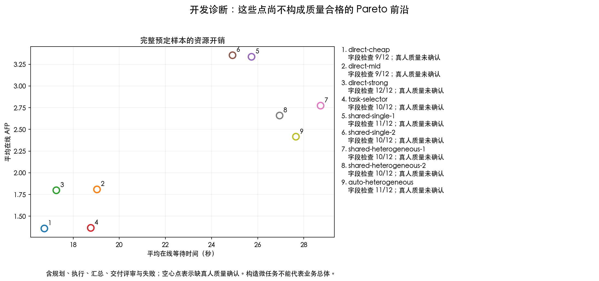
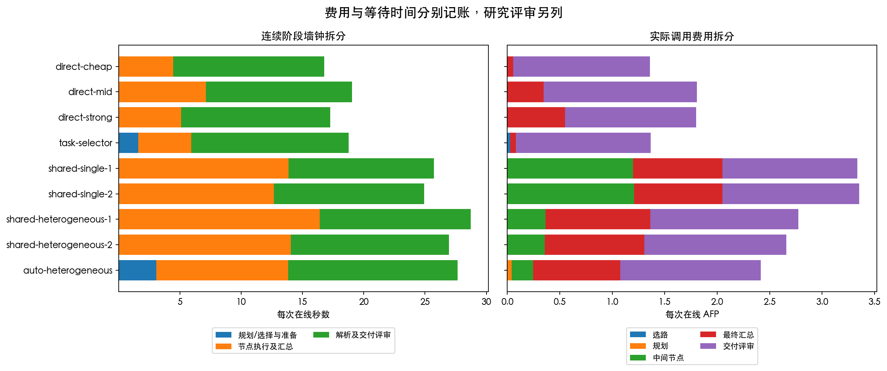

# Issue #53 开发对照结果

这六个已有构造任务上，自动 DAG 没有出现端到端资源优势：平均 27.66 秒、2.41556 AFP，
Pro 直接回答为 17.27 秒、1.79813 AFP。自动 DAG 的平均等待时间增加 60.13%，
线上 AFP 增加 34.34%。同图混合模型相对全 Pro 可降低 AFP，但尚未整体提速。
这支持暂缓扩大自动拆分策略，先解决质量审查和任务适用范围；不等于否定所有 DAG 场景。

本批为开发诊断，不能证明用户可接受质量。108 次运行中，89 次仍待真人确认，
19 次按冻结协议失败；不能只用那 89 次计算费用或时间，也不能把它们称为成功任务。
独立材料审查、盲审与用途确认仍缺失，候选留出未运行，#53 保持开放。

## 范围与验证

- 六个已有短构造开发题：材料分析、规则核对、多部分决策各两题，每题九条路线、两次重复。
- 108/108 次任务运行完成，474 次真实模型调用，实际按响应 token 用量及冻结费率复算为 **394.5012 AFP**。
- 本地完整测试 **736 项通过**；实现提交 `aa36528` 的三项 GitHub CI 通过。
- 54 次模拟任务运行完成流程审计，实际模型调用与 AFP 均为零，未混入真实统计。
- 逐调用费用、输入公开性、原始产物哈希、三阶段连续时序和同图/同模型分配审计通过；无缺失任务或未知费用。
- 实际执行代码为 `602fc08`。运行后核对 81 个实现文件及两份依赖文件，均与付费前冻结哈希一致。
- 零 HTTP 重试、零规划修复、零节点回退、零动态再拆；没有观察结果后补跑到成功。

`cheap/mid/strong` 分别为 `deepseek-v4-flash/minimax-m3/deepseek-v4-pro`，
规划/选择使用 Flash，交付及研究评审使用 `kimi-k3`。这些别名不代表已验证的能力排名。
计费来自响应使用量与 2026-09-06 费率快照的本地复算，没有独立核对 Ark 账单流水。

## 全部预定运行的资源与质量状态

每行 12 次运行；包括拒绝交付和解析失败，分母不变。
线上时间从任务进入到在线结束，包含规划/选择、节点、汇总、解析、交付评审及运行器开销。
共享图行是图已准备后的执行；准备费用及首次生成加执行的实测值另列。
字段通过是匹配冻结参考规则，不代表正文已被真人确认。

| 路线 | 平均线上秒数 | 中位数秒数 | 平均线上 AFP | 字段通过 / 12 | 待真人 / 失败 |
| --- | ---: | ---: | ---: | ---: | ---: |
| Flash 直接回答 | 16.75 | 16.58 | 1.35775 | 9 | 9 / 3 |
| M3 直接回答 | 19.03 | 19.65 | 1.80800 | 9 | 9 / 3 |
| Pro 直接回答 | 17.27 | 16.76 | 1.79813 | 12 | 11 / 1 |
| 整任务选模后直接回答 | 18.77 | 17.99 | 1.36482 | 10 | 10 / 2 |
| 共享图 Pro 串行 | 25.73 | 25.60 | 3.33600 | 11 | 10 / 2 |
| 共享图 Pro 并行 | 24.91 | 25.38 | 3.35397 | 10 | 10 / 2 |
| 共享图混合模型串行 | 28.73 | 29.08 | 2.77318 | 10 | 9 / 3 |
| 共享图混合模型并行 | 26.95 | 26.64 | 2.65931 | 10 | 10 / 2 |
| 在线自动 DAG 混合模型 | 27.66 | 26.79 | 2.41556 | 11 | 11 / 1 |

图中空心点表示缺少真人质量确认，不连接为合格前沿。以每次 2 AFP、20 秒为例，
直接回答及整任务选模的均值可能落在约束内，但均值不保证逐次满足，详见逐次违反数。
这只是已运行结果的事后筛查，不是这些预算下重新执行或对超时概率的保证。

## 配对机制诊断

表中差值为“候选减参考”，负数表示更少。先合并同题两次重复，再按六个来源族配对
重采样 10000 次；95% 区间仅作开发探索。六题不能当作十二个独立任务，
也不能以多项比较中最有利的一项作为确认性证明。

| 比较 | 平均 AFP 差 [探索区间] | 平均秒数差 [探索区间] |
| --- | ---: | ---: |
| 同图单模型并行 | +0.01798 [-0.06093, +0.12056] | -0.82 [-2.43, +1.52] |
| 同图异构并行 | -0.11387 [-0.19302, -0.03389] | -1.78 [-4.37, +0.82] |
| 同图串行选模 | -0.56281 [-1.01876, -0.20773] | +2.99 [+0.19, +5.06] |
| 同图并行选模 | -0.69466 [-1.07114, -0.35761] | +2.04 [-0.57, +4.33] |
| 自动全链路对直接回答 | +0.61743 [+0.25375, +1.01279] | +10.39 [+5.17, +15.19] |
| 自动全链路对整任务选模 | +1.05074 [+0.68492, +1.43956] | +8.89 [+3.42, +14.36] |

同图混合模型在串行时节省 16.87% AFP、耗时增加 11.63%；并行时节省 20.71% AFP、
耗时增加 8.19%。这是相对同图全 Pro 的局部费用变化，不是相对直接回答的收益。

同图单模型并行平均缩短 3.20%，混合模型并行缩短 6.19%；两个时间差区间都跨过零，
均未达到预定的 10% 有用增益量级。并行组 AFP 的变化也包含随机输出长度变化，
不能把“调度并行本身”解释为 token 费用下降的原因。

自动 DAG 相对整任务选模平均多用 76.99% AFP、多耗时 47.38%。
因此本批不能支持默认拆分这些简单任务，或继续以同图节省百分比代表端到端优势。

## 时间与费用在哪里

线上总计 **250.40075 AFP**，线下研究与准备 **144.10045 AFP**：

| 阶段 | AFP | 用途 |
| --- | ---: | --- |
| 在线选择 | 0.33490 | 整任务选模 |
| 在线规划 | 0.51010 | 每次自动生成 DAG |
| 中间节点 | 39.96275 | 节点执行 |
| 最终回答 / 汇总 | 65.73200 | 直接回答或图的最终交付节点 |
| 在线交付评审 | 143.86100 | 决定本次是否交付，计入用户使用成本 |
| 离线共享图准备 | 0.26145 | 六张图，各生成一次 |
| 离线研究评审 | 143.83900 | 研究诊断，不计入在线等待 |

在线交付评审占线上 AFP 的约 57.45%。自动路线的连续平均时间拆分为：
规划 3.05 秒、节点与汇总 10.79 秒、解析及交付评审 13.82 秒。
Pro 直接回答对应约 0.00、5.08、12.19 秒。评审是明显开销，
但不能为了画出收益而事后取消；任何更轻的验证方案都须先冻结其质量保障与失败规则。

共享图单模型从串行改并行后，节点排队总时长均值由 2.67 秒降至 0.16 秒，
节点运行区间重叠均值为 1.64 秒；混合模型对应 2.77 秒降至 0.14 秒、重叠 1.42 秒。
这证明发生了并发执行，但重叠规模不足以抵消全部额外节点和交付开销。
节点时长相加或依赖链调用时延都不等于用户实际等待。

原始 `critical_path_latency_ms` 保存按依赖累计的调用时延，不含排队和规划/交付阶段；
各路线的全量端到端时间以本报告的连续单调时钟为准。
首条进度发出中位数为 0.046 毫秒，仅是 CLI 发出事件，不是用户界面收到或看到答案的时间。

## 图的形态、首次使用与复用

共享图按任务生成，节点数依次为：材料分析两题 4/4、决策两题 4/3、规则核对两题 1/3。
自动路线每次重新规划，本批节点数为 1–4，并非固定三节点；12 次自动运行中有五次为单节点。
一张图是否能并行由其依赖决定，不能强制每题产生相同节点数量。

六次共享图准备总计 23.44 秒、0.26145 AFP。每题首次共享路线紧接准备执行，实测如下。
不同任务首次分配的路线不同，不能把这些观察当作九路线公平配对的应用冷启动比较。

| 任务 | 首次共享路线 | 准备加执行秒数 |
| --- | --- | ---: |
| analysis-01 | 共享图 Pro 串行 | 27.48 |
| analysis-02 | 共享图 Pro 并行 | 36.27 |
| decision-01 | 共享图混合模型并行 | 35.61 |
| decision-02 | 共享图混合模型并行 | 29.77 |
| rules-01 | 共享图 Pro 串行 | 18.64 |
| rules-02 | 共享图 Pro 串行 | 30.57 |

四条共享路线、六题的 24 组比较中，复用执行本身都比 Pro 直接回答更贵，
所以 AFP 均没有回本次数；增加复用次数无法消除执行费用的差额。
时间分配只有规则核对 `rules-01` 的混合串行路线出现 3 次回本点，其余无时间回本点。
这只是单题两次观察的分配诊断，不是可靠时延保证，也没有同质量确认。
1/3/10/100 次摊销情景保存在分析 JSON；摊销后的时间不能替代实测首次使用时间。

## 质量与编码问题

107 次输出可解析且符合新公开编码，另一次 M3 直接回答为 `JSONDecodeError`；
本批未触发边别名或列表规范化。字段结果为 92 次匹配、15 次不符、1 次未核验。
线上运行状态为 97 次交付待核验、10 次评审拦截、1 次解析失败；
其中有 8 次已被在线评审放行，却不符合冻结字段参考，最终仍列失败。
最终协议状态为 89 次待真人、19 次失败，没有任何一次被伪造为真人通过。

不符主要涉及设备归还数量、班次安排、已完成/可执行/阻断状态等内容，
不能再笼统称为“边格式错误”，也不能据字段匹配推断正文完整正确。
例如 Pro 直接回答 `decision-01-r1` 的字段匹配，但评审指出正文先否认可行解、后推荐组合的矛盾。
评审意见和冻结参考都仍需独立真人核验，不作为独立真值。

历史 15 条输出的事后编码诊断中，10 条可按 v2 有限公开规则规范化、4 条原本规范、
1 条仍不支持。该诊断未改写旧输出/旧判定，也未计作本批新调用或真实准确率。
规范化不交换边方向，不把端点名称等同于状态成立，未经支持的条件词不做模糊匹配。

## 后续决定与 Issue 边界

建议先收窄：保留直接回答作为必要对照，优先完成这批匿名输出的真人质量审查，
明确哪些任务值得拆分。下一批材料应有真实使用需求和实质可并行子问题，
经独立审查后再冻结新开发/留出设计；不在同六题上反复调优到出现正结果。

#53 的账本、阶段时序、完整开发配对、准备摊销、资源点与图表已落地；
但正式可接受质量和留出经验前沿尚未成立。#51 要求的随机混合、直接/DAG条件策略的收益比较，
以及 DAAO、FlowCompile、LLMCompiler 在该任务域的忠实适配或明确排除依据也未完成。
本批是 H2 机制诊断，不是全部 B0–B5 或 H1 输入感知收益验证。
动态再拆仍属 #55，当前负结果不支持优先增加它的实验复杂度。

## 证据与复现

- [冻结协议](../../docs/pareto-development-protocol.md)与[实际预检](live-01-preflight/frozen.json)。
- [原始会话](live-01/session.json)、[重评结果](live-01/evaluated-results.json)、原始及重评哈希索引。
- [分析 JSON](live-01-analysis/analysis.json)、[逐运行 CSV](live-01-analysis/paired-runs.csv)、
  [逐调用 CSV](live-01-analysis/calls.csv)、[分层统计](live-01-analysis/quality-statistics.json)。
- [匿名输出包](live-01-analysis/blind-output-packet.json)。路线映射只供协调者使用；本仓库访问控制
  不会自动阻止评审者查看映射，组织初审时应仅分发匿名包，不让初审者接触完整报告与映射。
- 图表同时提供 PNG/SVG 和输入哈希、绘图库版本；模拟图不混入真实结论。
- `live-preflight/` 是未执行的中间预检；真正运行使用 `live-01-preflight/`。
- 历史实验成本、原始数据及历史解释保留；本页 394.5012 AFP 只属于本次真实批次。

冻结了 API 模型标识、请求参数、费率、代码与客户端依赖；服务端权重、负载和缓存行为未完全受控。
每轮随机交错只能减轻部分顺序影响。本批只有六个构造题，没有足够证据外推到业务总体。
